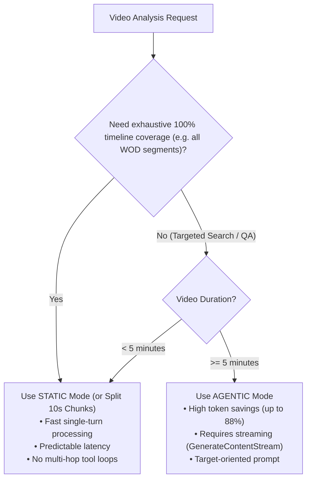

# Agentic Video Understanding Guidelines

## 1. Overview & Architecture

Gemini API (`google.golang.org/genai v1.70.0+`) provides two distinct video processing modes:

| Feature | Static Mode (`MediaProcessingStatic`) | Agentic Mode (`MediaProcessingAgentic`) |
|---|---|---|
| **Mechanism** | Extracts frames at fixed rate (default 1 FPS) and loads all frames into context in a single pass. | Dynamically navigates timeline via internal backend `MEDIA_PROCESSING` tool calls. |
| **Inference Flow** | Single-turn standard completion. | Multi-turn internal agent loop (Model $\leftrightarrow$ Video Decode Tool). |
| **Supported Models** | All Gemini 2.5 / 3.x models | `gemini-3.8-flash`, `gemini-3.7-flash`, `gemini-3.6-flash`, `gemini-3.5-flash-lite` |
| **Token Efficiency** | Linear ($\approx 260$ tokens/sec of video). Full context consumed. | Up to 88% token reduction on long videos for targeted queries. |
| **Latency Profile** | Predictable, bounded single-turn latency. | Highly variable; scales with the number of internal tool navigation hops. |
| **Best For** | Short clips (< 5m) or **exhaustive full-timeline indexing** (00:00 to end). | Long videos (> 5m) with **targeted queries**, specific event search, or QA. |

---

## 2. Decision Matrix: When to Use What



### Use STATIC (or Chunked Split) when:
- Building full-workout timelines ("Identify all exercises performed from start to finish").
- Real-time coaching requiring sub-5s response latency.
- Needing custom FPS or time-range clipping (`VideoMetadata` with `startOffset` / `endOffset`).

### Use AGENTIC when:
- Answering questions about specific moments in long videos (e.g., "Find the timestamp where athlete dropped the barbell").
- Verifying targeted technique flaws or injury risks on specific exercises across a long session.
- Token cost optimization on long videos where only 5–15% of the video content is relevant.

---

## 3. Critical Constraints & Anti-Patterns (Why Timeouts Occur)

### 🚫 Anti-Pattern 1: Exhaustive "Scrub Every Frame" Prompt with AGENTIC
* **The Trap:** Giving an Agentic model a prompt like:
  ```
  "Scrub through the entire video frame by frame and create a full timeline."
  ```
* **Why it fails:** The agent model tries to satisfy "frame-by-frame full scrubbing" by sequentially requesting dozen of slices via `MEDIA_PROCESSING` tool calls. Each tool hop requires a server-side roundtrip (decoding frames $\rightarrow$ feeding back $\rightarrow$ reasoning). A 15-minute video can trigger 30+ tool hops, blowing past the 10-minute deadline.
* **Rule:** **Never use full-scan/scrub prompts with Agentic mode.** Frame Agentic prompts around specific discovery goals or targeted inquiries.

### 🚫 Anti-Pattern 2: Unary HTTP (`GenerateContent`) on Agentic Calls
* **The Trap:** Calling `client.Models.GenerateContent(ctx, ...)` on long Agentic tasks.
* **Why it fails:** While the Gemini backend is running multiple internal tool hops (taking 1–5+ minutes), **zero response bytes** are sent over HTTP. Cloud NAT, GCP GFE (Google Frontend), reverse proxies, and OS TCP sockets trigger an **Idle Connection Timeout (504 / RST)**.
* **Rule:** **Always use `GenerateContentStream`** for Agentic video calls. Streaming delivers intermediate reasoning (`thought`) and tool invocation chunks continuously, keeping the TCP connection alive.

### 🚫 Anti-Pattern 3: Incompatible Options
* `genai.MediaProcessingAgentic` **cannot** be combined with:
  1. `VideoMetadata` (custom FPS, `StartOffset`, `EndOffset` clipping) — Agentic dynamically controls its own FPS and sampling.
  2. `CachedContent` API — Context caching is incompatible with agentic video processing. Use standard Files API upload; the uploaded file functions as the shared cache layer.

---

## 4. Implementation Pattern (Go SDK v1.71.0+)

### Standard Agentic Streaming Pipeline

```go
package gemini

import (
	"context"
	"fmt"
	"strings"
	"time"

	"google.golang.org/genai"
)

type AgenticObservation struct {
	ToolCalls     int
	ToolResponses int
	ThoughtText   string
	FinalText     string
	Usage         *genai.GenerateContentResponseUsageMetadata
}

// AnalyzeVideoAgentic runs an agentic video query safely using streaming to prevent idle timeouts.
func (c *Client) AnalyzeVideoAgentic(ctx context.Context, fileURI, mimeType, prompt string) (*AgenticObservation, error) {
	// 1. Establish bounded context (minimum 5m for long videos, maximum 10m)
	ctx, cancel := context.WithTimeout(ctx, 10*time.Minute)
	defer cancel()

	// 2. Configure Agentic MediaProcessing on the Part
	parts := []*genai.Part{
		{
			FileData: &genai.FileData{
				FileURI:  fileURI,
				MIMEType: mimeType,
			},
			MediaProcessing: genai.MediaProcessingAgentic,
		},
		genai.NewPartFromText(prompt),
	}
	contents := []*genai.Content{
		genai.NewContentFromParts(parts, genai.RoleUser),
	}

	// 3. Configure Thinking and Single Attempt (prevent hidden duplicate retries)
	config := &genai.GenerateContentConfig{
		MediaResolution: genai.MediaResolutionHigh,
		// Recommendation: Use MEDIUM or LOW thinking level for agentic video to minimize latency
		ThinkingConfig: &genai.ThinkingConfig{
			ThinkingLevel: genai.ThinkingLevelMedium,
		},
		HTTPOptions: &genai.HTTPOptions{
			RetryOptions: &genai.HTTPRetryOptions{Attempts: genai.Ptr(int32(1))},
		},
	}

	obs := &AgenticObservation{}
	var fullText strings.Builder
	var thoughtText strings.Builder

	// 4. STREAMING CONSUMPTION: keeps connection active and prevents idle timeout
	for resp, err := range c.client.Models.GenerateContentStream(ctx, ModelFlash38, contents, config) {
		if err != nil {
			return nil, fmt.Errorf("agentic stream error: %w", err)
		}

		if resp.UsageMetadata != nil {
			obs.Usage = resp.UsageMetadata
		}

		for _, cand := range resp.Candidates {
			if cand.Content == nil {
				continue
			}
			for _, part := range cand.Content.Parts {
				// Capture thinking tokens
				if part.Thought {
					thoughtText.WriteString(part.Text)
					continue
				}
				// Track agentic video navigation tool calls & responses
				if part.ToolCall != nil && part.ToolCall.ToolType == "MEDIA_PROCESSING" {
					obs.ToolCalls++
				}
				if part.ToolResponse != nil && part.ToolResponse.ToolType == "MEDIA_PROCESSING" {
					obs.ToolResponses++
				}
				// Accumulate final synthesized text
				if part.Text != "" {
					fullText.WriteString(part.Text)
				}
			}
		}
	}

	obs.FinalText = fullText.String()
	obs.ThoughtText = thoughtText.String()

	// 5. Verification: Ensure Agentic processing actually took place
	if obs.ToolCalls == 0 || obs.ToolResponses == 0 {
		// Log warning: model may have answered without inspecting video or fallback to text-only
	}

	return obs, nil
}
```

---

## 5. Production Architectural Recommendations

### Recommended Two-Stage Hybrid Pipeline
For WOD Strategist video analysis:
1. **Pass 1: Segmentation & Indexing (`STATIC` Mode or 10s Server Chunks)**
   - Use fixed-sampling (`STATIC`) or local 10s keyframe cuts.
   - Rapidly produce contiguous movement segments (`start`, `end`, `exercise_type`).
2. **Pass 2: Anomaly / Form Flaw Deep Verification (`AGENTIC` Mode)**
   - For identified complex movements (e.g. Snatch, Muscle-up) or flagged injury-risk intervals:
   - Prompt: *"Athlete was flagged performing Snatch between 03:20 and 04:15. Dynamically verify bar path deviations, hip extension completion, and foot positioning."*
   - Agentic dynamically seeks and verifies the exact micro-intervals with high precision and low token consumption.

---

## 6. Infrastructure & Deployment Rules

1. **Worker Context Only**: Never run long agentic video analysis synchronously in HTTP handlers (Cloud Run web requests). Always dispatch to asynchronous workers (Asynq queue / Cloud Tasks).
2. **Cloud Run Timeout Alignment**: If running inside a Cloud Run worker, set container execution timeout to 900s (15 min) or use Cloud Run Jobs.
3. **Audit & Logging**: When using direct Gemini Developer API (`generativelanguage.googleapis.com`), Cloud Audit logs will not log request bodies. Emit structured application logs (`zap.Logger`) containing:
   - `session_id`, `gemini_file_uri`, `mode="AGENTIC"`
   - `media_tool_calls`, `media_tool_responses`, `latency_seconds`
   - `input_tokens`, `output_tokens`, `thoughts_tokens`
