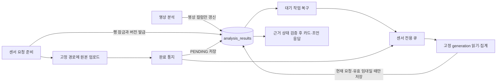

# Polar H10 센서 분석 및 운동 부하 가이드 — 단일 테이블 설계

작성: 2026-09-07 · 코드 대조 기준: `1046a88`

**상태: 구현을 위한 확정 설계. 이 문서 작성으로 코드 구현·마이그레이션·기기 검증이 완료된 것은 아니다.**

센서 분석의 영속 상태는 기존 `analysis_results` 한 테이블에 저장한다. `session_sensor_runs` 등 실행 테이블을 추가하지 않는다. 원본 NDJSON은 GCS에 두고 DB에는 최신 요청의 상태와 마지막 성공 요약만 보관한다. 기존 영상·세션·프로필 테이블의 역할은 유지한다.

이 문서는 이전 첨부 계획들의 센서 분석, 업로드 완료 통지, 재시도, 운동 시각 및 부하 가이드 설계를 대체한다. BLE 수집·NDJSON 기록 형식은 [기존 수집 문서](polar-sensor-pipeline-plan.md)와 현재 레코더를 따른다. 본문에 명시된 새로운 업로드 계약은 기존 수집 문서의 고정 파일 업로드 경로보다 우선한다.

## 1. 확정 범위와 보장 조건

- 센서 파일이 없으면 센서 요청·GCS 조회·센서 대기를 추가하지 않는다. 영상 분석은 센서의 성공 여부와 무관하게 완료된다. 공유 DB·CPU에서 물리적 지연이 정확히 0이라는 보장은 하지 않는다.
- v1은 비동기 센서 요약을 세션 부하 카드와 운동 전 안내에 연결한다. 진행 중인 영상/Gemini 분석 프롬프트에 센서를 뒤늦게 주입하거나 영상 재분석을 자동 시작하지 않는다.
- 수치의 의미는 **운동 종목·강도 기반 휴리스틱 부하**이다. 익일 통증, 생리학적 회복 완료, 부상 위험, 안전한 RPE, 확정 회복 시간을 진단하지 않는다. HR은 심폐 부하 보정에만 사용하며 시각적 폼 붕괴의 증거가 아니다.
- 최신성은 **서버가 승인한 업로드 요청 순서**로 정의한다. 파일의 GCS generation 수치나 통지 도착 순서를 비교하지 않는다.
- 한 세션에는 최신 요청 하나만 유효하다. 과거 모든 실행의 이력 조회·과거 요청 응답 재현은 제공하지 않는다. 이미 대체된 요청의 재시도는 명시적으로 거부한다.
- 큐 메시지는 중복될 수 있다. DB의 버전·실행 임대 검증으로 동일 요청의 결과 반영을 멱등하게 만든다. “정확히 한 번 큐잉”은 요구하지 않는다.
- 새 요청의 처리 중·실패 시 영상 단독 부하는 계속 제공한다. 마지막 성공 센서 요약은 보존하되 최신 요청과 버전이 다르면 현재 점수에 조용히 재사용하지 않는다.



## 2. 현재 코드에서 바꿔야 하는 지점

| 현재 상태 | 필요한 변경 |
|---|---|
| `analysis_results.session_id`에 유니크 인덱스가 있음 | 같은 행을 초기 생성한 뒤 행 잠금으로 센서 버전을 발급 |
| `video_analysis.go` 성공·실패 경로에 `UpdateAll: true`가 있음 | 모든 해당 경로를 영상 컬럼의 명시적 갱신으로 변경; 소유자·센서·운동 시각 보존 |
| `uploadSensorTelemetry`는 PUT만 수행하고 큐는 함수 성공 후 파일 삭제 | 업로드와 완료 통지를 구분한 영속 상태, 서버 접수 확인 후 삭제 |
| `assertOwnsSession`은 분석/청크가 없으면 통과 | 쓰기 전용 소유권 검증; 이 함수를 센서 쓰기 권한 확인으로 사용하지 않음 |
| `ComputeSessionMuscleLoads`는 내부적으로 `map[string]float64` 사용 | 새 함수도 같은 타입; UI DTO 변환 시에만 정수로 반올림 |
| 준비도는 `created_at`, 최근 최대 20개 기록 사용 | 공통 운동 시각, 전체 조회 범위의 근거 수 집계, 임의 20개 절단 제거 |
| Gemini가 정상 응답하면 기본 조언 함수는 실행하지 않음 | 생성 경로와 무관한 최종 근거 검증 적용 |

## 3. 스키마: `analysis_results`에만 컬럼 추가

아래 SQL은 구현 시 작성할 마이그레이션의 계약이다. 현재 다음 미사용 번호는 `000049`; 실제 구현 직전 다시 확인한다. 이 문서 작성 단계에서는 SQL을 적용하지 않는다.

```sql
ALTER TABLE analysis_results
    ADD COLUMN sensor_version BIGINT NOT NULL DEFAULT 0,
    ADD COLUMN sensor_state TEXT NOT NULL DEFAULT 'NONE',
    ADD COLUMN sensor_processing JSONB NOT NULL DEFAULT '{}'::jsonb,
    ADD COLUMN sensor_summary JSONB NOT NULL DEFAULT '{}'::jsonb,
    ADD COLUMN sensor_next_attempt_at TIMESTAMPTZ,
    ADD COLUMN workout_at TIMESTAMPTZ,
    ADD COLUMN workout_at_source TEXT;

ALTER TABLE analysis_results
    ADD CONSTRAINT analysis_results_sensor_version_nonnegative
        CHECK (sensor_version >= 0),
    ADD CONSTRAINT analysis_results_sensor_state_valid
        CHECK (sensor_state IN
            ('NONE', 'UPLOADING', 'PENDING', 'RUNNING', 'COMPLETED', 'FAILED', 'EXPIRED')),
    ADD CONSTRAINT analysis_results_sensor_json_objects
        CHECK (jsonb_typeof(sensor_processing) = 'object'
           AND jsonb_typeof(sensor_summary) = 'object');

CREATE INDEX idx_analysis_results_sensor_due
    ON analysis_results (sensor_next_attempt_at, id)
    WHERE sensor_state IN ('UPLOADING', 'PENDING', 'RUNNING');

CREATE INDEX idx_analysis_results_profile_workout_at
    ON analysis_results (profile_id, workout_at DESC, id DESC)
    WHERE status = 'COMPLETED' AND archived_at IS NULL;
```

`sensor_version`은 Go `int64`, HTTP에서는 십진 문자열로 전송한다. generation도 문자열로 전송하고 GCS SDK 호출 직전에 범위를 검사해 `int64`로 변환한다. JavaScript `number`로 왕복하지 않는다. `sensor_processing`은 `json:"-"`로 내부에 한정하며 공개 응답은 별도 DTO로 구성한다.

down 마이그레이션은 위 인덱스·CHECK를 `IF EXISTS`로 제거하고 추가 컬럼을 `DROP COLUMN IF EXISTS`로 제거한다. 기존 영상 컬럼과 행은 삭제하지 않는다. 센서 결과는 down 시 소실되므로 운영에서 이전 앱으로 되돌릴 때는 먼저 기능을 끄고 컬럼은 유지하는 방식이 기본이다.

### 3.1 최신 요청 상태의 예시

아래 값은 형식 예시이며 실측 데이터가 아니다.

```json
{
  "schema_version": 1,
  "request_id": "2f6cc9a1-c278-4b90-b23d-8400deec0e88",
  "base_version": "0",
  "object_name": "videos/42/WOD-20260907-01K00000000000000000000000/sensor_telemetry_v1_2f6cc9a1-c278-4b90-b23d-8400deec0e88.ndjson",
  "target_generation": null,
  "expected_size_bytes": 123456,
  "expected_sha256": "실제 구현에서는 소문자 16진수 64자리",
  "calculation_inputs": {
    "calculation_version": 1,
    "age": 35,
    "max_hr": 185,
    "max_hr_source": "estimated_220_minus_age",
    "has_hr_zones": true
  },
  "requested_at": "2026-09-07T03:00:00Z",
  "upload_expires_at": "2026-09-08T03:00:00Z",
  "attempts": 0,
  "lease_token": null,
  "lease_started_at": null,
  "last_error_code": null
}
```

`sensor_version`과 `sensor_state`는 별도 컬럼만 진실의 원천으로 사용한다. JSON에 중복 저장하지 않는다. signed URL, 인증 토큰, 전체 프로필은 저장하거나 로그에 출력하지 않는다. `calculation_inputs`는 **prepare 최초 성공 시점**에 동결하며 같은 요청의 재시도에서 다시 만들지 않는다.

`sensor_summary`에는 성공한 `version`, `request_id`, `source_generation`, `calculation_version`, `calculation_inputs`, 품질 상태, 지표, `hr_bonus`, 산출 시각을 포함한다. 새 prepare가 기존 요약을 지우지는 않는다. 조회 시 아래 조건을 모두 만족해야 현재 센서 입력으로 사용할 수 있다.

```text
sensor_state == COMPLETED
summary.version == sensor_version
summary.request_id == processing.request_id
summary.source_generation == processing.target_generation
summary.calculation_version is supported
```

## 4. 소유권과 행 생성

센서의 모든 prepare/status/complete 요청은 JWT와 `profile_id > 0`를 요구한다. `profile_id`는 인증 사용자의 프로필이어야 한다.

1. `sessions`, `analysis_results`, `chunk_analysis_results`에서 해당 session ID의 소유 프로필을 확인한다. 존재하는 모든 소유 정보가 요청 프로필과 일치해야 한다. 충돌은 409, 타인 소유는 403으로 처리한다.
2. 기존 `analysis_results`가 없으면 `status='PENDING'`인 최소 영상 결과 행을 `INSERT ... ON CONFLICT (session_id) DO NOTHING`으로 만든다. `analysis_type`은 현재 타입 해석 규칙을 따른다. 없는 `sessions` 행을 요구하거나 새로 만들지 않는다.
3. 같은 트랜잭션에서 `SELECT ... FOR UPDATE` 후 `profile_id`를 다시 확인한다. 다른 프로필의 동시 최초 생성은 유니크 인덱스와 재검증으로 거부한다.
4. 어디에도 행이 없는 신규 세션은 인증된 프로필에 이 최초 행으로 귀속한다. 최초 video/chunk 쓰기도 기존 귀속과 일치하는지 검증해야 한다. `ON CONFLICT`에서 `profile_id`를 바꾸지 않는다.
5. 센서가 만든 최소 행은 일반 영상 결과처럼 `status`가 COMPLETED가 되기 전까지 완료 이력에 포함하지 않는다. 기존 이력/UI가 PENDING 행을 조회하는 경로에서도 센서만 있는 행을 영상 분석 완료로 표시하지 않는다.

모든 외부 I/O는 DB 잠금을 해제한 후 수행한다. 센서 트랜잭션은 짧게 유지하고 `lock_timeout=500ms`, `statement_timeout=2s`를 적용한다. 잠금 실패는 재시도 가능한 응답이며 영상 상태를 변경하지 않는다.

## 5. 요청 발급을 업로드보다 먼저 수행

### 5.1 업로드 준비 API

신규 `POST /api/v1/sessions/:session_id/sensor-upload`:

```json
{
  "profile_id": 42,
  "request_id": "클라이언트가 파일별로 생성하고 영속 저장한 UUID",
  "expected_version": "0",
  "size_bytes": 123456,
  "sha256": "파일 내용의 SHA-256"
}
```

완전히 닫힌 파일만 요청한다. 크기는 1바이트 이상 20 MiB 이하, 해시는 소문자 16진수 64자리다. 파일 해시 계산은 청크 단위로 수행하며 녹화 시작/중지의 영상 경로를 대기시키지 않는다.

행 잠금 안에서 아래 순서로 처리한다.

1. 현재 `request_id`가 같으면 파일 크기·해시·base version도 일치하는지 확인한다. 같으면 현재 버전·상태·동결 입력을 반환한다. 내용이 다르면 409 `REQUEST_CONTENT_CONFLICT`다.
2. 다른 요청이면 `expected_version == sensor_version`을 검사한다. 다르면 409 `SENSOR_VERSION_CONFLICT`; 자동으로 최신 버전에 맞춰 재접수하지 않는다.
3. 일치하면 workout 시각을 §9 규칙으로 먼저 최초 확정한다. 이후 `sensor_version += 1`, `sensor_state='UPLOADING'`, 요청 정보와 입력 스냅샷, 24시간 업로드 유효기간을 저장하고 `sensor_next_attempt_at`을 해당 만료 시각으로 설정한다. 새 요청은 이전 요청을 대체한다. `retry_not_before`, lease, attempts, 이전 오류는 새 요청에서 초기화한다.
4. commit 이후 전용 signed URL을 발급한다. URL 생성 실패 후에도 동일 요청으로 prepare를 재시도할 수 있다.

최초 클라이언트 요청은 `expected_version='0'`이다. 기존 서버 센서 버전이 있는 세션에 대한 **사용자 요청 또는 명시적인 신규 파일 생성**만 status API로 현재 버전을 읽고 새 요청 ID를 만든다. 오래된 오프라인 큐 항목은 충돌 시 자동으로 새 버전을 만들지 않고 `SUPERSEDED`로 종료한다.

응답: `request_id`, `version`, `state`, `object_name`, `upload_url`, `required_headers`, `expires_at`. 같은 요청이 이미 PENDING/RUNNING/COMPLETED이면 PUT URL 없이 현재 접수 상태를 반환한다. EXPIRED/FAILED의 동일 요청에 새 버전이나 새 입력을 발급하지 않는다.

### 5.2 덮어쓰지 않는 GCS 파일

서버가 다음 경로를 구성한다. 클라이언트가 임의 경로·버킷을 지정하지 않는다.

```text
videos/{profileId}/{sessionId}/sensor_telemetry_v{version}_{requestId}.ndjson
```

- 기존 세션 prefix 안에 평평한 파일명을 사용하므로 `path.Base` 규칙과 충돌하지 않는다. generation별 파일 이력 DB 테이블은 필요 없다.
- PUT signed URL에 `Content-Type: application/x-ndjson`, `x-goog-if-generation-match: 0`, 요청 해시 메타데이터를 바인딩한다. 클라이언트는 응답의 필수 헤더를 그대로 전달한다.
- `x-goog-if-generation-match: 0`은 객체가 이미 있으면 생성 요청을 거부한다. 동일 PUT의 응답 유실 후 다시 보내도 기존 파일을 교체하지 않는다. [GCS 사전조건](https://docs.cloud.google.com/storage/docs/request-preconditions), [XML PUT 규칙](https://docs.cloud.google.com/storage/docs/xml-api/put-object).
- URL 유효기간은 15분이다. 만료 시 같은 prepare 요청으로 URL만 갱신한다. 새 버전은 발급하지 않는다.
- 기존 일반 `/upload-url`에서 `sensor_telemetry_v` 예약 접두사에 대해 무조건 PUT URL을 발급하지 않도록 제한한다. 새 센서 파일은 전용 경로만 사용해 생성 사전조건을 우회하지 못하게 한다.
- PUT의 412는 접수 완료가 아니다. 완료 API가 객체 일치 여부를 검증한 뒤에만 성공으로 간주한다.
- 고정 경로 `sensor_telemetry.ndjson`은 이전 앱의 보관 파일로 유지하지만 v1에서 자동 발견·자동 분석하지 않는다. 기존 로컬 큐는 새 요청 계약으로 전환해 업로드한다. 이미 서버에만 있는 과거 파일의 일괄 가져오기는 별도 작업이다.

### 5.3 완료 통지 API

`POST /api/v1/sessions/:session_id/sensor-complete`:

```json
{"profile_id":42,"request_id":"준비 단계의 UUID","version":"1"}
```

1. 소유권과 현재 요청 tuple을 확인한다. 오래된 버전/다른 ID는 409 `SENSOR_REQUEST_SUPERSEDED`다.
2. 이미 PENDING/RUNNING이면 202, COMPLETED이면 200을 반환한다. FAILED는 실패 코드와 `retryable`을 반환하며 완료 접수 성공으로 위장하지 않는다.
3. UPLOADING이면 저장된 경로의 GCS attrs를 잠금 밖에서 읽는다. 크기·Content-Type·바인딩된 해시 메타데이터를 확인한다. 실제 바이트 SHA-256은 워커가 검증한다.
4. 잠금을 다시 잡아 같은 tuple·UPLOADING·유효기간인지 확인한다. 그동안 새 요청이 생겼으면 갱신하지 않는다. 검증한 generation 문자열을 저장하고 PENDING, `sensor_next_attempt_at=now()`로 commit한다.
5. commit 이후 즉시 큐 등록을 시도한다. 큐 장애가 있어도 DB에 접수된 요청은 복구 루프가 처리하므로 202 `accepted=true`를 반환할 수 있다. DB 저장 실패는 성공 응답을 반환하지 않는다.

완료 요청 중 GCS 404는 `UPLOAD_NOT_FOUND`로 반환한다. 만료·타인 소유·파일 불일치와 구별한다. generation의 대소 비교는 하지 않으며 워커는 저장된 generation으로 고정 읽기한다.

`GET /api/v1/sessions/:session_id/sensor-status?profile_id=...`는 현재 tuple, 상태, 실패 코드, 재시도 가능 여부만 반환한다. 준비 요청 이전에는 version=0, NONE이다. 이 API는 앱 재시작·409 처리·진행 UI에 사용하고 일반 영상 분석 경로에서 호출하지 않는다.

## 6. 모바일 영속 큐

기존 일반 telemetry 큐의 직렬 저장·동시 flush 방지 기능은 재사용한다. 센서용 큐 항목에는 아래 상태를 추가하고 일반 디버그 업로드의 동작은 바꾸지 않는다.

```text
PREPARE_PENDING → PUT_PENDING → COMPLETE_PENDING → ACCEPTED → 로컬 파일 삭제
                         ↘ PUT 결과 불명 → COMPLETE_PENDING에서 서버 확인
오래된 요청 충돌 → SUPERSEDED (자동 새 버전 발급 금지)
```

필수 저장값: session/profile/file path, UUID, expected/server version, size/hash, stage, attempts, next retry time. UUID·해시·단계 변경은 네트워크 호출 이전/직후 내구성 있게 저장한다. stage 저장 실패 시 파일을 삭제하지 않는다.

- 현재 일반 큐의 `saveQueue`는 저장 오류를 잡고 계속 진행하고, `loadQueue`는 파일 손상을 빈 큐로 취급한다. 센서 모드에서는 두 동작을 사용하지 않는다. 쓰기 오류를 호출자에게 전파하고 다음 네트워크 단계로 진행하지 않는다. 임시 파일 기록 후 같은 디렉터리에서 교체하는 방식과 마지막 정상본 복구를 적용하고, 실제 플랫폼의 교체 동작을 검증한다. 둘 다 읽을 수 없으면 큐 손상으로 중단하며 UUID를 새로 생성해 재업로드하지 않는다.
- PUT 성공 또는 응답 불명/412 후에는 완료 API로 객체 존재를 확인한다. 이 상태에서 prepare/PUT부터 무조건 반복하지 않는다.
- 완료 API가 `UPLOAD_NOT_FOUND`라고 확인한 경우만 같은 요청·같은 경로의 PUT을 재시도한다. 이는 업로드가 실제로 끝나지 않은 경우다.
- HTTP 성공 여부뿐 아니라 `accepted`, 응답 tuple, 상태를 확인한 후 ACCEPTED를 영속 저장한다. 그 뒤 파일 삭제·큐 제거를 수행한다. 삭제 직전 앱이 죽어도 재시작은 ACCEPTED 항목 정리만 수행한다.
- prepare 응답 유실은 같은 UUID/base version으로 재시도한다. 서버가 이미 대체된 요청이라고 응답하면 새 version으로 자동 재발급하지 않는다.
- 네트워크/5xx/429는 5초부터 최대 5분의 지수 backoff와 jitter로 재시도한다. 일반 큐의 최대 횟수 도달 시 무조건 항목 제거 규칙을 센서에는 적용하지 않는다. 24시간 후에는 파일을 보존한 `NEEDS_ATTENTION` 상태로 두고 명시적 재시도/삭제만 허용한다.
- 서버 접수 이후 분석 실패는 파일 업로드 실패와 구분한다. GCS가 원본을 보관하므로 자동 재업로드하지 않는다.
- 이전 형태의 로컬 센서 큐 항목은 파일이 있으면 한 번만 UUID를 생성·저장하고 PREPARE_PENDING으로 전환한다. 이미 서버 버전이 있으면 충돌을 사용자에게 표시하고 자동 덮어쓰지 않는다.

## 7. 워커, 임대, 복구

### 7.1 상태 전이

| 상태 | 뜻 | 다음 전이 |
|---|---|---|
| NONE | 센서 요청 없음 | prepare → UPLOADING |
| UPLOADING | 요청 발급, 파일 완료 미확인 | complete → PENDING; 24시간 초과 → EXPIRED |
| PENDING | DB에 처리 접수됨 | 실행 선점 → RUNNING |
| RUNNING | 임대 토큰을 가진 워커가 처리 중 | 성공 → COMPLETED; 일시 실패 → PENDING; 영구 실패/시도 초과 → FAILED |
| COMPLETED | 현재 요청의 요약 저장 완료 | 같은 요청은 no-op |
| FAILED / EXPIRED | 해당 요청 자동 처리 종료 | 기존 결과 보존, 신규 명시적 요청만 새 version 발급 |

어느 상태에서도 올바른 expected version을 가진 명시적인 신규 prepare는 이전 요청을 대체할 수 있다. 예전 워커의 결과는 이후 반영할 수 없다.

### 7.2 실행 선점과 조건부 저장

태스크에는 `analysis_result_id`, `profile_id`, `request_id`, `version`만 넣는다. 객체 경로·스냅샷은 DB에서 읽는다. 태스크 자체의 값으로 소유권·파일 경로를 변경하지 않는다.

1. 짧은 트랜잭션에서 tuple과 상태 확인. PENDING이고 `retry_not_before`가 없거나 도래한 경우, 또는 RUNNING 임대가 만료된 경우에만 선점한다.
2. 랜덤 `lease_token`, 시작 시각, attempts+1, RUNNING을 저장한다. `sensor_next_attempt_at`을 DB 현재 시각+60초로 설정한다. 동시 메시지는 유효 임대가 있으면 no-op이다.
3. 20초 간격 heartbeat로 같은 tuple/token의 임대만 연장한다. 한 번의 처리는 최대 120초로 제한한다. GCS 읽기·파싱은 context 취소와 크기 제한을 따른다.
4. 고정 generation 읽기, 원본 해시·스키마·품질 검증 후 계산한다. prepare 시 동결된 입력만 사용한다.
5. 성공 저장은 아래와 같은 조건부 UPDATE 한 번으로 요약·상태를 함께 갱신한다. 센서 워커가 다시 INSERT하거나 영상 필드를 갱신하지 않는다.

```sql
UPDATE analysis_results
SET sensor_summary = $1::jsonb,
    sensor_state = 'COMPLETED',
    sensor_next_attempt_at = NULL,
    sensor_processing = $2::jsonb,
    updated_at = NOW()
WHERE id = $3
  AND profile_id = $4
  AND sensor_version = $5
  AND sensor_state = 'RUNNING'
  AND archived_at IS NULL
  AND sensor_processing->>'request_id' = $6
  AND sensor_processing->>'target_generation' = $7
  AND sensor_processing->>'lease_token' = $8
  AND sensor_next_attempt_at > NOW();
```

0행 갱신이면 요청이 대체·삭제되었거나 다른 실행이 선점한 것이므로 결과를 폐기한다. 무조건 저장으로 폴백하지 않는다. 실패·heartbeat 갱신에도 같은 version/request/token 조건을 적용한다. 중복 계산이 발생하더라도 현재 유효한 실행만 결과를 확정한다.

선점·heartbeat·재시도 갱신도 `archived_at IS NULL`을 요구한다. 만료된 임대는 heartbeat로 되살리지 않는다. heartbeat는 유효기간 안에서만 같은 토큰으로 연장하며 120초 실행 상한은 연장하지 않는다.

### 7.3 DB와 Redis 사이에서 유실된 작업 복구

새 테이블 대신 `sensor_state`와 `sensor_next_attempt_at`을 영속적인 처리 대기 기록으로 사용한다.

- 워커 프로세스 시작 시와 10초마다 복구 루프를 실행한다. 여러 프로세스에서는 `FOR UPDATE SKIP LOCKED`, 최대 100행 배치로 대상을 선택한다.
- 기한이 된 PENDING 또는 임대가 만료된 RUNNING을 잠근다. PENDING으로 전환하고 다음 전송 예정 시각을 60초 뒤로 설정한 뒤 commit하고 큐에 보낸다. 만료된 RUNNING의 이전 토큰은 무효화한다.
- PENDING의 `sensor_next_attempt_at`은 **메시지 재전송 예정 시각**이다. 정상적으로 전달된 메시지는 이 시각이 미래여도 실행할 수 있다. 일시 실패의 backoff는 별도 JSON 필드 `retry_not_before`로 검사한다. 복구 스캔도 이 필드보다 이른 작업을 보내지 않는다.
- 큐 등록 실패 또는 등록 직후 프로세스 종료가 발생해도 다음 스캔에서 재전송한다. Redis task ID의 보존 기간을 정합성의 근거로 사용하지 않는다.
- 센서 태스크의 asynq 자동 retry는 0으로 두고 DB가 재시도 횟수·대기 시간을 관리한다. 요청당 최대 5회 선점하며 타임아웃도 1회로 센다. 선점 전에 상한을 확인하고 5회 소진 시 FAILED로 전환한다.
- 일시 실패의 재시도 대기는 5/15/45/120초다. 실패 저장 시 `retry_not_before`와 `sensor_next_attempt_at`을 이 시각으로 설정한다. 잘못된 JSON, 크기/해시 불일치, 미지원 스키마는 즉시 FAILED다. GCS 일시적 5xx는 재시도하고 확정된 대상 generation 소실은 FAILED로 처리한다.
- UPLOADING의 24시간 기한 만료는 EXPIRED로 처리한다. 파일을 발견했다는 이유만으로 완료 통지 없이 접수하지 않는다.
- 같은 worker 프로세스에 센서 전용 asynq 큐와 Concurrency=1인 별도 서버를 시작해 영상 작업 슬롯을 소비하지 않게 한다. 메모리·DB·프로세스 자원은 공유하므로 영향은 부하 시험으로 측정한다. 종료 시 복구 루프·heartbeat·양쪽 서버를 context로 정리한다.

## 8. 센서 파서와 지표

### 8.1 입력 계약

- schema `2.0.0`의 meta와 이벤트를 현재 `PolarSensorRecorder`에 맞춰 읽는다. `profile_id`, `workout_session_id`는 요청과 일치해야 한다. `t/dt/rr` 단위는 ms, ACC v의 단위는 g다.
- 현재 레코더의 `stream_id`는 숫자다. Go에서도 정수형으로 읽는다. 과거 예시의 `map[string]float64`를 JSON 입력형으로 그대로 사용하지 않는다.
- meta는 처음에 하나, end는 마지막에 하나만 허용한다. 종료가 확인된 파일만 부하 보정에 사용한다. 중단 파일은 `incomplete` 진단을 남기되 HR 보너스·활동 초수에 사용하지 않는다.
- `attrs.Size`와 `LimitReader(MaxBytes+1)`로 20 MiB 초과를 감지한다. Scanner 최대 행 길이는 1 MiB다. `scanner.Err()`, 각 행의 JSON·필수 키, end 뒤 비어 있지 않은 행, 기록 건수의 일관성을 검사한다. Scanner만으로 footer 누락이나 논리적 불완전성을 감지했다고 간주하지 않는다.
- 전체 파일 문자열이나 전체 ACC 배열을 메모리에 쌓지 않는다. 스트림별 현재 에포크, 집계값, HR 직전 값만 유지한다. SHA-256은 같은 읽기 스트림에서 계산해 기대값과 비교한다. 메타·이벤트의 크기도 행/파일 상한을 적용한다.
- NaN/Inf, 잘못된 dt, 같은 채널/스트림 안의 시각 역행, 중복 end를 조용히 보정하지 않는다. HR 행 뒤에 더 이른 첫 샘플을 담은 ACC 패킷이 오는 것은 정상일 수 있으므로 서로 다른 채널에 전역 정렬을 요구하지 않는다. 시작 전 ACC 샘플과 end 뒤 샘플은 분석 구간 밖으로 제외하며 시간을 앞으로 밀어 보정하지 않는다. 정상 계산이 불가능하면 품질 오류로 처리한다. 알려지지 않은 선택 이벤트는 건수만 기록해 건너뛰되, 알려진 이벤트의 필수 필드 누락과 구별한다.

### 8.2 HR

- BPM 30~240 범위의 유한값을 채택한다. 연속 유효 샘플 간격이 0초 초과 5초 이하이면 앞의 값을 해당 구간의 대표값으로 쓴다. 5초 초과는 구간 전체를 unknown으로 처리한다. 마지막 점 뒤로 외삽하지 않는다.
- explicit gap과 pause 구간은 적분에서 제외한다. end까지의 capture 시간에서 pause의 합집합을 뺀 값을 커버리지 분모로 사용한다. 분모 0은 계산 불가다. 영상 청크 사이 공백은 사람의 운동 시간에서 빼지 않는다.
- 시간 가중 평균, min/peak, valid_seconds, coverage, unknown_seconds를 저장한다. coverage>=0.50이고 시간축·파일 완전성이 유효할 때만 `valid_hr=true`다.
- 심박존은 동결된 max_hr에 대한 `[0,60%)`, `[60,70%)`, `[70,80%)`, `[80,90%)`, `[90%,∞)`의 5구간이다. Zone 1이 60% 미만을 포함한다는 정의를 UI 도움말에 명시한다. 각 존 비율의 분모는 valid HR seconds이며 세션 전체 시간과 혼용하지 않는다.
- age는 workout_at의 UTC 연도에서 BirthYear를 뺀 근삿값이다. 13~100세의 유효값에서만 추정 max_hr=`220-age`를 사용한다. 그렇지 않으면 null/has_hr_zones=false다. 생일이나 실측 최대심박이 있다고 가정하지 않는다. 나이는 참고용 심박존 표시에만 사용한다.
- **v1 HR 보너스는 단일식:** `valid_hr ? clamp((weighted_mean_bpm-140)*0.5, 0, 20) : 0`. 심박존 비율을 추가 가산하지 않는다. 기존 참고 보정식에 시간 가중 평균을 사용하는 것으로, 생리학적 타당성이 검증된 척도가 아니다. 심박존 유무나 이후 프로필 편집에 따라 식을 바꾸지 않는다.

### 8.3 ACC

- stream_start.sampling.acc_hz를 stream_id별로 유지한다. 같은 스트림에서도 새 앵커가 오면 집계 구간을 나눈다. 주파수가 불명확하면 해당 구간은 unknown이다.
- 패킷의 i번째 샘플 시각은 `t + i*dt`다. 현재 레코더의 t는 **첫 샘플의 오프셋**이므로 끝 샘플 기준으로 다시 보정하지 않는다.
- dt와 주파수 불일치, 중복/역행, gap/pause/재앵커를 가로지르는 에포크는 unknown이다. 1초 반개구간에서 유효한 고유 샘플 수가 기대 수의 80% 이상이고 최대 내부 간격이 3/Hz 이하여야 한다. 마지막 1초 미만 구간은 unknown이다.
- `abs(norm(a)-1g)`의 모분산 `<0.05 g²`를 `low_movement_seconds`, 그 외를 `other_movement_seconds`, 부족한 창을 unknown으로 집계한다. 이 임계값은 초기 휴리스틱이며 “휴식·회복·운동하지 않음”의 판정에 쓰지 않는다. 실기기 검증 전에는 진단용으로 제한한다.
- ACC를 HR 보너스·근육군 점수·휴식 시간 지시에 사용하지 않는다. RR은 진단/향후 용도의 원본으로 보존하며 운동 중 HRV에서 회복 지표를 생성하지 않는다.

### 8.4 capture/media

사람의 세션 지표는 capture clock으로 계산한다. 영상 표시와 대응할 때만 `CaptureToMedia`를 사용한다. 청크는 시작 포함·종료 제외 구간이며 최종 청크 종점만 별도 허용한다. 겹침·역순·비유한값·미확정 media 경계는 무효다. `media_start + capture-start`가 media_end를 50ms 초과하면 false, 50ms 이내만 클램핑한다. 청크 사이 공백은 false다. 전체 최대 종료 시각이 비슷하다는 이유로 identity mapping을 허용하지 않는다.

세그먼트 HR은 샘플 점만 고르지 않고 유효 HR 구간과 각 capture 구간의 교집합 길이로 적분한다. v1 일반 카드는 세션 요약만 표시한다. 세그먼트 표시나 영상 중첩 기능을 추가할 때도 이 시간축 규칙을 따른다.

## 9. workout_at 확정과 백필

같은 `timeline.ResolveWorkoutAt` 구현을 신규 행 생성과 백필 명령에서 호출한다. SQL로 임의의 8자리 숫자를 날짜로 변환하지 않는다.

반환값은 `(Time, Source, ReliableForReadiness)`다. 우선순위는 다음과 같다.

1. 현행 `{TYPE}-YYYYMMDD-{ULID}`와 기존 서버 형식 `WOD-YYYYMMDDHHMM-{ULID}`를 **전체 일치**로 검증한다. ULID 앞 48bit를 UTC 시각으로 해석하며 사람이 읽는 날짜 부분에서 자정을 만들지 않는다. source=`session_ulid`다.
2. `P{id}-WOD-YYYY-MM-DD-HH-MM` 등 실제 지원하는 레거시 형식을 전체 일치로 해석한다. source=`legacy_local_time`이다. 시간대는 설정 `LEGACY_WORKOUT_TIMEZONE=Asia/Seoul`에 고정한다. DB 세션/워커 머신의 TZ에 의존하지 않는다. 과거 시각에 시간대가 없을 때의 제품상 가정임을 기록한다.
3. 해석할 수 없으면 기존 Session.CreatedAt, 다음 AnalysisResult.CreatedAt을 사용한다. source는 각각 `session_created_fallback`, `analysis_created_fallback`이다. 실제 운동 시각이라고 단정할 수 없어 준비도 계산의 시각 근거에서 제외한다.

잘못된 월일·ULID overflow·기준 레코드 생성 시각보다 5분을 초과하는 미래 값은 다음 후보로 넘어간다. 미래 검사의 기준은 처리 시점 now가 아닌 영속된 레코드 생성 시각이다. 파싱 불가 값 하나로 전체 백필을 중단하지 않는다.

신규 행은 INSERT 시 created_at을 한 번 확정한 뒤 같은 트랜잭션에서 시각을 해석한다. `WHERE workout_at IS NULL`인 경우만 갱신한다. 센서/영상의 후속 성공·실패·재분석으로 workout_at을 덮어쓰지 않는다. 해석 가능한 ID에서는 도착 순서와 무관하게 같은 시각이다. 해석 불가 ID의 created_at 대체값은 도착 순서에 따라 달라질 수 있으므로 준비도에서 제외하며 “100% 동일 운동 시각”이라고 보장하지 않는다.

스키마 마이그레이션 후 재개 가능한 Go 전용 명령으로 NULL 행을 ID 순서·500행 단위로 처리한다. dry-run, 소스별 건수 집계, 이미 갱신한 행 건너뛰기를 제공한다. 기존 점수와 created_at은 변경하지 않는다. 날짜 정책 변경은 별도 명시적 이관으로 처리하고 일반 센서 retry에 섞지 않는다.

신규 쓰기 대응을 먼저 배포하고 백필을 실행한다. 대상 NULL 행이 없음을 확인한 뒤 새 준비도 읽기를 활성화한다. 백필 전 NULL 행은 unknown으로 처리한다.

## 10. 부하 계산과 근거 상태

### 10.1 세션 부하

```go
func ComputeSessionMuscleLoadsWithSensor(
    sessionScoreJSON string,
    sensorSummaryJSON string,
) (map[string]float64, bool)
```

호출자는 §3 최신성 조건을 확인해 summary 또는 `{}`를 전달한다. 함수 내부에서도 품질 조건을 검증한다. 현재 프로필은 인자로 받지 않는다.

- SessionScore.Movements의 유효한 종목만 사용한다. 빈 문자열/unknown/walking/rest/setup 등은 제외한다. 기존 정규화·종목 카탈로그로 해석 가능한 키만 사용하며 빈 문자열 부분 일치나 미확인 종목의 일괄 기본 부하를 허용하지 않는다. 정규화 후 같은 종목을 중복 가산하지 않는다.
- 유효 종목이 0개이면 `(nil,false)`다. 센서만으로 근육군 부하를 만들지 않는다.
- `I=max(0.5,min(1.5,intensity/70))`, 유효한 양의 강도가 없으면 I=1이다. 종목마다 `30*I*weight[m,g]`를 가산한다. 30은 비교용 고정 기준이며 횟수·시간·중량의 측정값이 아니다.
- 유효한 현재 summary의 `hr_bonus`만 cardio_metabolic에 가산한다. 각 군을 0~100으로 제한하고 내부는 float64를 유지한다. 종목·강도가 바뀌는 영상 재분석에서는 부하가 달라질 수 있지만, 프로필 변경/동일 센서 재통지 때문에 바뀌지는 않는다.
- 폼 붕괴 횟수, 고정 회복 시간, 미확인 rep 수는 생성하지 않는다. 식과 카탈로그 변경 시 `load_calculation_version`을 올리고 의도적 모델 변경으로 취급한다.

### 10.2 세션 API와 UI

`SessionFatigue`에 status, load_calculation_version, sensor_status, heart_rate_adjusted를 추가한다. available일 때만 overall_score/muscles/guidance를 반환한다. insufficient_evidence는 점수를 null/생략하고 HistoryList의 축소 배지까지 “분석 근거 부족”으로 표시한다. 상태 코드만 추가하고 기존 0% 배지를 남기지 않는다.

TypeScript는 status 기준 판별 union을 사용한다. 구 API의 status 없음+유효 muscles는 기존 카드로 표시하고 새 가이드는 생략한다. 신규 앱 배포 전에는 새 nullable 응답을 활성화하지 않는다.

전체 점수는 6개 근육군 평균을 반올림한 값이다. 경계는 <=25 low, <=50 moderate, <=75 high, 초과 extreme이다. 주의 부위는 반올림한 군별 점수가 50 이상인 상위 2개이며 동점은 고정 키 순서를 사용한다. 점수는 “%” 대신 “/100” 참고 점수로 표시한다.

guide는 state_code와 advice_code(low_load/moderate_load/high_load/extreme_load)를 반환한다. 모든 언어에서 “이번 세션의 추정 운동 부하”와 조건부 조절로 한정한다. “관측된 과부하·내일의 잔여 피로·안전한 정상 강도”라고 번역하지 않는다. HR 가산 시 “실측 심박으로 보정한 추정값”으로 표시하고 근피로 자체를 실측한 것으로 표현하지 않는다.

## 11. 준비도·Gemini·최종 응답

### 11.1 이력 선택

- 평가 시각 `asOf`를 요청 시작 시 한 번 고정해 조회·감쇄·응답에서 공유한다.
- 비아카이브·COMPLETED 중 신뢰 가능한 workout_at이 `[asOf-7일, asOf]`인 모든 세션을 대상으로 한다. 20건 LIMIT로 자르지 않고 많으면 페이지 단위로 집계한다.
- 날짜 NULL/대체 시각/미래 값으로 최근 7일 포함 여부를 판단할 수 없는 이력은 `unresolved_time_sessions`로 따로 센다. 시각 미확정인 모든 비아카이브 완료 행이 대상이다. created_at으로 임의로 기간 밖에 밀어내지 않는다. 잘못된 데이터 수정/아카이브까지 불확실성을 표시한다.
- `total_sessions`는 “시각이 확정된 최근 7일 건수”, valid는 그중 부하 계산이 가능한 건수, excluded=total-valid다. unresolved_time_sessions는 이 등식에 섞지 않는다.
- 시간과 부하가 유효한 기록만 SessionLoadRecord로 만들어 기존 설정 반감기로 감쇄한다. 참고 점수의 시간 감쇄이며 회복 완료 추정이 아니다.

| 조건 | evidence_status | 표시 |
|---|---|---|
| total=0, unresolved=0 | no_history | 기록 없음. fresh로 분류하지 않음 |
| valid=0, total+unresolved>0 | insufficient | 평가 근거 부족. 0점/fresh로 표시하지 않음 |
| valid>0, excluded>0 또는 unresolved>0 | partial | 확인된 일부 이력의 참고값 |
| valid=total>0, unresolved=0 | complete | 조회 범위의 필수 입력이 있는 참고값 |

`ProfileReadinessState`와 `PreWODAdviceResponse` 양쪽에 건수·status·as_of를 추가한다. no_history/insufficient이면 전체·근육군 점수를 null/생략한다. partial의 점수는 불완전한 이력으로 계산한 값임을 명시한다.

제외 전 건수는 컨트롤러에서 보존해 계산기에 명시적으로 전달한다. 필터링된 records만 보고 total을 복원하지 않는다.

```go
type EvidenceCounts struct {
    TotalSessions          int
    ValidSessions          int
    ExcludedSessions       int
    UnresolvedTimeSessions int
}

func ComputeCurrentReadiness(
    records []SessionLoadRecord,
    evidence EvidenceCounts,
    asOf time.Time,
) ProfileReadinessState
```

호출 전에 `valid == len(records)`, `total == valid + excluded`, 모든 건수가 음수가 아님을 검증한다. 이력 선택은 동일한 읽기 전용 REPEATABLE READ 트랜잭션에서 수행해 페이지 조회 사이의 영상/센서 완료로 건수와 records가 어긋나지 않게 한다. 트랜잭션을 끝낸 뒤 Gemini를 호출한다. 모델 응답을 기다리는 동안 DB 잠금을 유지하지 않는다.

### 11.2 출력 제한

`BuildPreWODAdvicePrompt`와 기존 기본 응답을 수정하고, **마지막에 공통 `FinalizePreWODAdvice`** 를 반드시 거친다.

- complete: 기존 참고 부하에 따른 제안은 가능하나 신체 안전이나 기록 경신 능력을 단정하지 않는다.
- no_history/insufficient: v1에서는 Gemini를 호출하지 않는다. target_rpe=null, 고정 코드 `check_condition`과 “최근 운동 근거만으로 강도를 판단할 수 없습니다. 실제 컨디션을 확인하세요”를 반환한다. 근거 부족을 이유로 고정 RPE 7을 새로운 안전값으로 만들지 않는다.
- partial: v1에서는 Gemini를 호출하지 않는다. 확인 가능한 부하를 표시하고 target_rpe=null, `partial_history`의 정형 조절 안내를 반환한다. 누락된 이력에도 불구하고 최대 강도를 제안하지 않는다.
- 최종 처리기는 위 상태에서 모델 결과가 전달되더라도 RPE·pacing·overall_summary·자유 문장 scaling 등을 근거 상태별 결정론적 DTO로 교체한다. 점수만 낮추고 “기록 경신에 도전”이라는 문장을 남기지 않는다.
- 수치·상태·근육군 근거는 항상 서버 계산값을 사용하고 모델이 만든 점수를 채택하지 않는다. 모델 DTO 전체를 대입하지 않고 complete에서 허용된 설명 항목만 채택한다.
- `PreWodStrategyCard.tsx`, 프론트 전략 DTO, HistoryList, 영어·한국어 사전에 null RPE와 unknown/partial을 반영한다. 구 클라이언트와의 배포 순서는 §13을 따른다.

## 12. 구현 파일과 의존 순서

| 순서 | 파일/범위 | 구현 내용 |
|---|---|---|
| 1 | `api/internal/db/migrations/000049_*`, `db.go` | 추가 컬럼·제약·부분 인덱스·Go 타입 |
| 2 | `api/internal/timeline/workout_at.go`, `api/cmd/backfill-workout-at/main.go` | 공통 시각 해석, 재개 가능한 백필 |
| 3 | `api/internal/worker/video_analysis.go`와 session ID 쓰기 경로 | 소유자 보존, 선택적 upsert, 시각 최초 확정 |
| 4 | `api/internal/controllers/sensor_handlers.go`, `ownership.go`, `api/internal/server/router.go` | prepare/status/complete, 소유권·CAS·공개 DTO |
| 5 | `api/internal/storage/gcs.go` | 생성 전용 서명 URL, attrs 조회, generation 고정 reader. 기존 일반 메서드 유지 |
| 6 | `features/health/polar/sensorTelemetryUpload.ts`, `features/debug/telemetryUpload.ts`, `features/wod/api.ts` | 센서 영속 단계, 필수 헤더, 응답 확인, 이전 큐 이관과 재시도 |
| 7 | `api/internal/sensor/{parser,quality,metrics}.go` | 스트리밍 집계, 해시·품질, 동결 입력 사용 |
| 8 | `api/internal/worker/sensor_telemetry.go`, `sensor_recovery.go`, `api/cmd/worker/main.go`, config | 실행 임대, 복구 루프, 전용 큐, 시작·종료 처리 |
| 9 | `api/internal/fatigue`, `highlight_response.go`, `strategy_handlers.go`, `strategy_dto.go` | 공통 float 부하, 근거 집계, 최종 응답 제한 |
| 10 | `features/wod/history.ts`, 전략 API 타입, `WorkoutFatigueCard.tsx`, `HistoryList.tsx`, `PreWodStrategyCard.tsx`, 영어·한국어 JSON | 점수·미확인·partial·null RPE의 일관된 표시 |

새 repository 계층이나 범용 작업 프레임워크를 만들지 않는다. 기존 db/GCS/asynq 클라이언트에 필요한 메서드만 추가한다. 구현 완료 후에는 기존 피로도·업로드 설명을 실제 코드에 맞춰 갱신한다.

## 13. 검증·배포·롤백

### 13.1 필수 테스트

| ID | 조건 | 합격 기준 |
|---|---|---|
| A1 | 타인 profile/session, 소유자 충돌, 센서 선도착 | 부당한 쓰기 0건. 정당한 sessions 행 없는 세션 처리 가능 |
| A2 | 다른 profile이 같은 session에 동시에 최초 prepare | 한 소유자에만 귀속. 후속 영상 upsert도 소유자 변경 불가 |
| V1 | 동일 prepare 동시/응답 유실 후 재전송 | 동일 version/request/input. 다른 내용은409 |
| V2 | 동일 expected version에서 서로 다른 두 요청 | 하나만 새 버전 발급. 다른 하나409. MAX+1·자동 재접수 없음 |
| V3 | 새 요청 접수 후 구 prepare/complete/worker 완료 | 현재 요청·summary 변경 없음 |
| V4 | 새 요청의 GCS generation이 수치상 더 작음 | 정상 반영. 대소 비교 없음 |
| U1 | PUT 성공 후 통신 단절·412·앱 강제 종료 | 같은 객체 확인, generation 재발급 없음 |
| U2 | complete 응답 유실·단계 저장 직전/직후 종료 | 같은 tuple로 재접속. ACCEPTED 확인 후 로컬 삭제 |
| U3 | prepare 실패·URL 만료·24시간 초과·기존 큐 이관 | 파일·고정 ID 보존. 자동 새 버전·조용한 삭제 없음 |
| U4 | 디스크 쓰기 실패·큐 JSON 손상·임시 파일 교체 중 종료 | 오류 전파/정상본 복구. 새 UUID 생성·빈 큐 취급·원본 삭제 없음 |
| Q1 | DB commit 직후 종료·Redis 중단·전송 직후 종료 | 복구로 재개. 접수된 작업의 영구 유실 없음 |
| Q2 | 중복 워커·60초 임대 만료 후 이전 워커 복귀 | 유효 임대만 commit. 이전 token은0행 갱신 |
| Q3 | 영구 오류·5회 소진·워커 재시작 | 무한 retry 없음. 영상 status 영향 없음 |
| Q4 | 새 요청/삭제와 워커 성공 경합 | 삭제 행 재생성 없음. 과거 결과·상태 부활 없음 |
| T1 | 현행/구 ID·잘못된 날짜·ULID overflow·연도 경계·DB TZ 변경 | 신규 생성과 Go 백필의 시각·source 일치 |
| T2 | 영상 선완료·센서 선완료·기존 행·영상 실패와 재분석 | workout_at 불변. 해석 불가 시각은 준비도에서 제외 |
| P1 | 20MiB/20MiB+1·거대 행·end 누락·identity/hash 불일치 | 명시적 품질 결과·메모리 상한. 부분 자료 정상 취급 없음 |
| P2 | 숫자 stream_id·재앵커·dt·25/50Hz·gap/pause·중복 시각 | 시각·커버리지·unknown초가 fixture와 일치 |
| P3 | HR 커버리지49%/50%·BPM 경계·존 경계·마지막 점 | 유효성·분모·보너스가 명세와 일치 |
| F1 | 센서 없음/실패/구 summary·종목 없음/unknown만 존재 | 영상 단독 또는insufficient. 숨은0점 생성 없음 |
| F2 | prepare 후 프로필 변경·동일 요청 재시도 | 동결 입력·HR 보너스 불변 |
| R1 | 전체 유효·일부 누락·전체 누락·이력 없음·시각 미확정·21건 이상 | 건수 등식·status·7일 경계 일치 |
| R2 | partial/insufficient/no_history에 모델RPE9 강제 주입 | 최종 DTO에 고강도 문구·RPE9 없음. 정상 경로에서는 모델 미호출 |
| UI1 | 구/신 API·null RPE·축소 이력·영한 전환 | 빈 배지·0%·미번역·undefined 없음 |
| O1 | 센서 없음·손상/대용량 센서 동시 처리 | 영상 경로에 센서 GCS 대기 없음. 지연·메모리는 실측 보고 |

DB 경합/임대/시각 백필은 실제 PostgreSQL, GCS/asynq는 저장소의 실제 클라이언트+MockTransport/테스트 Redis 방식으로 검증한다. 신규 Ginkgo 패키지는 suite를 작성한다. 컨트롤러의 비공개 함수를 worker 패키지에서 직접 호출하지 않는다. API·최종 응답은 controllers, 순수 집계는 fatigue, 큐 처리는 worker에서 테스트한다.

```bash
# 구현 이후 검증 명령. 신규 마이그레이션은 미적용이면 먼저 up한다.
(cd api && make migrate-test-up)
(cd api && go build ./... && go vet ./...)
(cd api && go test ./internal/sensor/... ./internal/timeline/... ./internal/fatigue/...)
(cd api && go test ./internal/controllers/...)
(cd api && go test ./internal/worker -ginkgo.focus='SensorTelemetry|SensorRecovery|VideoAnalysis')
npm run typecheck
npm run test -- features/health features/wod/ui/WorkoutFatigueCard.test.tsx
git diff --check
```

controllers의 특정 Populate 테스트만 실행해 소유권·최종 응답 검증을 누락하지 않는다. 신규 프론트 전략/이력 테스트도 실제 작성된 파일명으로 실행 대상에 포함한다. H10 실기기·통신 단절·앱 재시작 결과와 합성 fixture 결과를 구별한다.

### 13.2 배포 순서

1. 스키마 추가 후 기능 플래그 OFF로 API/worker 호환 코드를 배포한다. 모든 영상 쓰기의 선택적 upsert를 먼저 반영한다.
2. 새 DTO를 이해하는 모바일 UI를 배포한다. 센서 전용 큐·필수 헤더 동작은 실기기에서 확인한다.
3. workout_at 백필을 dry-run 후 실행한다. NULL 잔여 행·source별 건수·조회 범위를 확인한다. 시각 미확정은 삭제하지 않고 unknown으로 둔다.
4. 센서 prepare/complete와 전용 worker를 활성화해 제한된 사용자에게 검증한다. 이후 대응 클라이언트에만 새 가이드 DTO를 활성화한다. 구 앱에 갑자기 nullable 필드를 보내지 않는다.
5. 플래그 OFF는 신규 접수를 중단한다. 이미 접수된 PENDING/RUNNING은 완료까지 처리하거나 명시적으로 FAILED로 종료한다. 작업을 영구 대기시키거나 영상이 센서를 기다리게 하지 않는다.

플래그는 기존 설정을 사용하며 새 설정 테이블은 만들지 않는다. 대응 클라이언트는 명시적 API capability `X-Workout-Load-Schema: 1`로 식별하고 version/nullable 계약을 테스트한다. 새 근거 상태 보장은 이 계약을 사용하는 응답에 적용한다. 구 API 동작을 새 계약의 안전성 검증 결과로 간주하지 않는다.

### 13.3 보존 기간과 제약

DB에는 최신 요청과 마지막 성공 summary만 남는다. 과거 요청을 SQL로 모두 조회할 수는 없다. 진단용 구조화 로그에는 request/version/error를 기록하고 원본·프로필은 출력하지 않는다.

새 버전별 GCS 객체는 기존 세션의 보존/삭제 정책을 따른다. 새로운 고아 파일 삭제 작업이나 버킷 전체 수명주기 설정은 이번 변경에 포함하지 않는다. 기존 session/profile 삭제가 세션 prefix 전체를 정리하는지 검증한다. 서명 URL 발급 후 최대 15분은 늦은 PUT이 가능하므로 기존 삭제 흐름의 재정리 대상에 포함한다. 삭제 후 이전 worker가 DB 행을 재생성하지 않는다.

아카이브된 행의 신규 prepare/complete는 거부하고 기존 실행 임대를 무효화한다. 소유 프로필 삭제 후에는 인증/소유권 단계에서 재요청을 거부한다. 물리적으로 삭제한 세션 ID를 영구 재사용 금지하는 기능은 현재 한 행만 유지하는 계약에 포함하지 않는다. 별도의 삭제 이력 없이 과거 요청의 모든 재현을 기억한다고 보장하지 않는다.

## 14. 이전 문제 대응표

| 문제 | 이 설계의 대응 |
|---|---|
| 테이블 증가·sessions 행 부재 | analysis_results 최소 행만 생성(§3–4) |
| MAX+1 경합·늦은 통지 역전 | prepare 행 잠금·expected version·고정 요청(§5) |
| PUT 재시도로 generation 변경 | 요청별 고정 경로·생성 전용 PUT·단계별 큐(§5–6) |
| 재통지 시 프로필 입력 변경 | prepare 입력 동결·워커의 DB 입력 사용(§3,7) |
| DB 저장과 Redis 접수 사이 종료 | 같은 행의 PENDING·due index·복구 루프(§7) |
| 중복/이전 워커 쓰기 | 현재 tuple·임대의 최종 조건부 UPDATE(§7) |
| 소유권 검사 fail-open | 프로필 확인·전체 소유자 대조·최초 귀속 보호(§4) |
| 백필/재처리에서 시각 변경 | 같은 Go 함수·출처 기록·최초 확정(§9) |
| 근거 부족=0점/RPE9 | 전체 집계·unknown·모델 미호출·최종 응답 제한(§10–11) |
| 영상 작업이 센서 값 삭제 | 영상 전용 컬럼 갱신·센서 상태 분리(§2,12) |

설계 결정과 테스트 통과는 별개다. 구현 완료 여부는 §13의 실패·재시도·경합 시나리오를 포함한 검증 결과로 판단한다.
