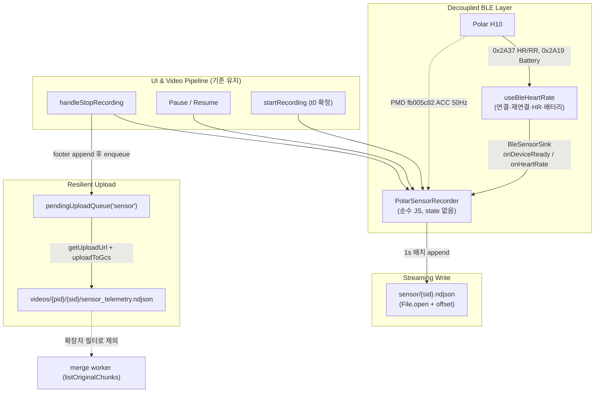

# Polar H10 시계열 센서 수집 파이프라인 구현 계획 (v2)

> v1 계획에 대한 코드 검증 리뷰 반영본.
> 원안 검증 기준: 브랜치 `sunjin/correct-recog-person` / 2026-09-06.
> 상태: 센서 파이프라인은 미구현 제안. Phase 0.1 필터와 테스트는 최종 점검 시 별도 작업의 워킹트리 변경으로 추가된 것을 확인했다(이 리뷰에서는 실행·배포 미검증). 2026-09-06 문서 일관성 리뷰 반영. PMD 프로토콜·단위·설정 지원은 공식 명세와 Phase 0.2 실기기 픽스처로 검증해야 하며, 이 문서의 예시는 실측 결과가 아니다.
> v1의 3대 원칙(관심사 분리 · 단일 시계 계약 · 스트리밍 저장)은 유지하되,
> 실제 코드와 충돌하던 전제 3건과 설계 결함 4건을 교정했다.

---

## 0. v1 대비 변경 요약

| # | v1 | v2 | 근거 |
|---|---|---|---|
| 1 | "백엔드 변경 0, GCS 직접 PUT" | GCS 직접 PUT 유지 + **`listOriginalChunks` 확장자 필터 추가(필수)** | `videos/{pid}/{sid}/`의 비영상 오브젝트가 청크 목록에 섞여, 정상 DB 경로에서는 대응 분석 행을 기다리며 merge가 재시도됨 ([merge_chunks.go:433-450](../api/internal/worker/merge_chunks.go#L433-L450)) |
| 2 | 훅이 `device: Device \| null` 반환 | 훅이 **`BleSensorSink` 콜백을 주입받음** | ref 반환은 비반응형이고, 재연결 시 새 `Device` 객체로 교체되어 레코더가 죽은 핸들을 잡음 |
| 3 | HR/RR은 훅, ACC는 레코더 (전달 경로 없음) | 훅의 `parseHeartRate`에서 **레코더로 push** | 스키마의 `heart_rate_samples`가 파일에 도달할 경로가 v1에 없었음 |
| 4 | `stop()`에서 JSONL → 단일 JSON 재조립 | **NDJSON 그대로 업로드** (푸터 한 줄 append로 종료) | 6만 라인 파싱 + 6만 원소 `JSON.stringify`는 v1이 피하려던 메모리 2배·JS 스레드 블로킹을 그대로 재현 |
| 5 | "expo-file-system append" | **신규 `File`/`FileHandle` API 명시** + 목(mock) 추가 작업 | 레포가 쓰는 `expo-file-system/legacy`에는 append가 없음 ([telemetryRecorder.ts:12](../features/debug/telemetryRecorder.ts#L12)) |
| 6 | ACC = int16 LE 배열, 디바이스 타임스탬프 직접 사용 | **delta-frame 디코딩 + 수신시각 앵커링**, 실기기 덤프 픽스처 선행 | H10 PMD는 delta 압축 프레임을 보내고, 타임스탬프는 2000-01-01 에폭의 **디바이스 시계**라 `base_epoch_ms`와 직접 뺄 수 없음 |
| 7 | `sensorTelemetryUpload.ts` 신규 작성 | **기존 큐를 파라미터화해 재사용** | [telemetryUpload.ts](../features/debug/telemetryUpload.ts)와 90% 동일한 코드 복제 방지 |
| 8 | 배터리 드레인율·급방전 경고 | **초기 수집 범위에서 제외**, raw start/end만 기록 | `0x2A19`는 1% 스텝 보고 → 20분 세션에서 0~1% 변화, 파생 지표는 노이즈 |
| 9 | UI 문자열 하드코딩(한국어) | **`t()` + `en.json`/`ko.json` 동시 추가** | [app/AGENTS.md](../app/AGENTS.md) CRITICAL 제약 |

---

## 1. 제안 계약과 구현 제약

### 1.1 시간축 계약 — `clock_source: "capture_clock"`

- **t0(`base_epoch_ms`)** = `recordingStartTime.current` ([visionTestPage.tsx:744](../app/workout/visionTestPage.tsx#L744)).
  파일의 `t`는 t0 기준 경과 **밀리초**이며 일시정지 구간을 **포함**한다. `Date.now()`는 시계 보정으로 역행할 수 있으므로 단조 증가를 보장한다고 쓰지 않는다. HR/수명주기 이벤트는 수신 wall clock을 사용하고, ACC는 아래 디바이스 앵커 변환을 사용한다. 시계 점프가 감지되면 새 동기화 구간을 기록하며 무조건 값을 증가시키는 보정은 하지 않는다.
- **캡처시계 vs 미디어시계 분리 (2026-09-07 교정):**
  - 센서 NDJSON의 `t`, `chunk_analysis_results.start_secs`/`end_secs` = **캡처시계**(사람 기준 실제 경과시간).
  - `merged.mp4` 재생 위치, `media_start_secs`/`media_end_secs` = **미디어시계**.
  - 일시정지 0회인 31분 세션에서도 188개 청크 경계 공백(각 ~278ms)으로 인해 미디어시계와 캡처시계 간 **52.31초 드리프트**가 실측되었다. 따라서 `pause_intervals`는 사용자 일시정지 표시 전용이며 두 시계 간 변환에 쓸 수 없다.
  - 두 시계의 변환은 공용 변환기(`api/internal/timeline.CaptureToMedia`)를 통한 **청크별 구간 선형 매핑**으로만 가능하다.
    - 해당 캡처 시각을 포함하는 청크를 찾아 `media_start + (capture - start)`.
    - 어떤 청크에도 속하지 않는 청크 경계 공백(전체의 약 2.7%)은 대응 영상 프레임이 없으므로 `ok = false`.
    - `media_*`가 NULL이거나 `media_end == end`인 과거/미보정 세션은 `ok = false`.
  
  **용도별 시계 규칙:**

  | 대상 | 시계 |
  |---|---|
  | 하이라이트 클립 구간, 하드섭 자막, 재생 seek | 미디어시계 |
  | 심박·가속도·피로도·페이싱 등 사람 기준 지표 | 캡처시계 |
  | 센서를 영상 위에 겹치기 | 캡처 → 청크별 매핑으로 변환 (`api/internal/timeline`) |

- **일시정지 처리:** pause/resume을 발생 시점에 **인라인 이벤트 라인**으로 기록하고, 종료 시 푸터에서 `pause_intervals`로 집계한다.
  (인라인 기록 → 앱이 죽어도 부분 파일이 해석 가능)
- **pause 중 PMD 스트림:** **유지한다.** 정지·회복 구간의 심박/무동작 관측 가치가 있고, 스트림 재시작 실패 리스크를 피할 수 있다.
- **데이터 갭 정책 (v2 신규):** iOS는 `UIBackgroundModes`에 `bluetooth-central`이 없어
  ([app.json:29-31](../app.json#L29-L31)) 백그라운드 알림의 지속 수신을 보장할 수 없다. 실제 중단 여부와 길이는 기기에서 검증한다.
  타임라인에 **결측 구간이 존재할 수 있음**을 계약에 명시하고, 다운스트림은 이를 `dropped_packets`(패킷 손실)와 구분해 처리한다.

### 1.2 관심사 분리 — 훅은 PMD를 모른다, 대신 sink를 안다

`useBleHeartRate`는 스캔/연결/재연결/HR(`0x2A37`)/배터리(`0x2A19`)만 담당하고 PMD 코드는 0줄을 유지한다.
단, v1의 `device` 반환 대신 **sink 인터페이스**를 주입받아 수명주기와 HR 이벤트를 밀어준다.

```ts
// features/health/bleSensorSink.ts
export interface BleSensorSink {
  /** 연결/재연결로 새 Device 핸들이 준비될 때마다 호출 (PMD 재구독 지점) */
  onDeviceReady(device: Device, hasPmd: boolean): void;
  /** 끊김/정리 시 호출 — 레코더는 구독을 버리고 갭으로 표시 */
  onDeviceLost(reason: string): void;
  /** parseHeartRate 콜백에서 직접 push (React state 지연·드롭 없이 RR 보존) */
  onHeartRate(bpm: number, rrIntervalsMs: number[], receivedAtMs: number): void;
}
```

- 훅: `useBleHeartRate({ sink }: { sink?: BleSensorSink })` — sink가 없으면 기존과 동일하게 동작.
- 레코더: `PolarSensorRecorder`가 sink를 구현. React state가 없어 50Hz 리렌더 부하 0.

### 1.3 업로드 경로 — 기존 서명 URL 재사용 + 백엔드 필터 선행

- 클라이언트는 [`getUploadUrl`](../features/wod/api.ts#L242) → [`uploadToGcs`](../features/wod/api.ts#L254)를 그대로 재사용한다.
  (서명 URL이 Content-Type을 바인딩하지 않으므로 `application/x-ndjson` PUT 가능 — [gcs.go:50-65](../api/internal/storage/gcs.go#L50-L65))
- 적재 경로: `videos/{profileId}/{sessionId}/sensor_telemetry.ndjson`
  — `sanitizeObjectPart`가 `path.Base`로 잘라내므로 클라이언트가 서브디렉토리를 지정할 방법은 없다
  ([handlers.go:520-527](../api/internal/controllers/handlers.go#L520-L527)).
- **따라서 백엔드 필터 배포가 선행되어야 한다.** 검토 시작 시 `listOriginalChunks`는 확장자 검사 없이 제외 목록에 안 걸린 모든 오브젝트를 청크로 취급했다. 최종 점검에서는 `.mp4`/`.mov` 필터가 워킹트리에 추가됐다. 아래는 필터가 없는 버전의 실패 경로다.
  정상 DB 경로에서는 센서 파일에 대응하는 청크 분석 행이 없으므로 merge가 이를 미완료 청크로 간주해 재시도한다. DB 없는 목록 기반 fallback에서는 비영상 입력이 concat에 도달할 수 있다. stop 시점의 업로드/목록 조회 순서에 따라 발생 여부가 달라지는 **경합 조건**이다.
- (후속 선택지) `/upload-url`에 `kind`를 추가하면 서버가 `videos/{pid}/{sid}/sensors/`처럼 **세션 prefix 내부** 경로를 만들 수 있다. `sensors/{pid}/{sid}/` 같은 새 최상위 prefix는 [AGENTS.md](../AGENTS.md)의 저장 규칙과 충돌하므로 사용하지 않는다. 현재 `path.Base` 처리에서는 클라이언트 파일명만으로 하위 경로를 만들 수 없다.

---

## 2. 아키텍처



---

## 3. 저장 포맷 — NDJSON (`sensor_telemetry.ndjson`)

한 줄 = 하나의 이벤트. 헤더 → 샘플/이벤트 → 푸터 순으로 **append만** 한다. 실제 파일에는 주석이나 행 내부 줄바꿈을 쓰지 않는다. `t`/`dt`/`rr`는 ms, 가속도 `v`는 g 단위다.
`stop()`은 푸터 한 줄을 붙일 뿐이므로 재조립·재파싱이 없다.

```jsonl
{"k":"meta","schema_version":"2.0.0","workout_session_id":"WOD-20260906-01JQXYZ3K4M5N6P7Q8R9ABCDEF","profile_id":1,"clock_source":"capture_clock","base_epoch_ms":1788673845000,"requested_sampling":{"acc_hz":50,"acc_range_g":8,"acc_resolution_bits":16},"device":null,"app":{"version":"1.0.0","platform":"android"}}
{"k":"device_ready","t":500,"stream_id":1,"device":{"name":"Polar H10 12345678","firmware":null,"battery_percent_start":92}}
{"k":"stream_start","t":600,"stream_id":1,"sampling":{"acc_hz":50,"acc_range_g":8,"acc_resolution_bits":16},"clock_anchor":{"device_timestamp_ns":"1000000000000","capture_offset_ms":600,"method":"first_packet_received"}}
{"k":"hr","t":1000,"bpm":134,"rr":[448,446]}
{"k":"battery","t":120000,"percent":91}
{"k":"acc","t":1200,"stream_id":1,"dt":20,"v":[[0.02,0.98,-0.15],[0.05,1.02,-0.12]]}
{"k":"pause","t":125000}
{"k":"resume","t":140000}
{"k":"gap_start","t":150000,"gap_id":1,"reason":"disconnected"}
{"k":"gap_end","t":155000,"gap_id":1}
{"k":"end","t":1200000,"pause_intervals":[{"start_offset_ms":125000,"end_offset_ms":140000}],"device":{"battery_percent_end":90},"summary":{"hr_samples":1200,"acc_samples":60000,"dropped_packets":null,"gaps":1}}
```

위 예시는 중간 샘플·재연결 이벤트를 생략한 형식 예시다. 푸터 합계는 예시이며 표시된 샘플 행 수의 합계가 아니다. 재연결 시 새로운 `stream_id`/앵커를 기록한다.

설계 근거
- **패킷 단위 배치**: 50Hz × 20분 = 결측 없는 경우 60,000 ACC 샘플. 라인 수는 실제 패킷당 샘플 수에 따라 달라진다. 1초마다 디스크에 flush하는 주기와 BLE 패킷 주기는 다르며, 파일 크기·라인 수는 Phase 0.2 덤프로 측정한다.
- **`v: [[x,y,z]]` 배열**: 샘플마다 키를 반복하지 않는다. 절감률은 동일 데이터 직렬화 결과로 비교한다.
- **배터리 시계열 (`k: "battery"`, D-1)**: 배터리 잔량(%) 변화 시점마다 `{"k":"battery","t":...,"percent":...}` 이벤트를 기록하여 세션 내 방전 곡선을 보존한다(중복 수치 전송 시 미기록).
- **푸터 부재 = 종료 미확인**: 유효한 앞부분은 복구 가능하다. 푸터 존재만으로 전체 무결성을 보장하지 않으며, 파서가 행 유효성·샘플 합계·시간축·열린 갭을 확인한다.
- 메타의 `requested_sampling`은 희망 설정이다. 실제 협상 결과는 `stream_start.sampling`에 기록한다. 장치·펌웨어·배터리를 읽지 못하면 `null`로 두고 고정값을 만들지 않는다.
- `gap_start`/`gap_end`로 결측 구간을 표현한다. 파일 종료까지 복구되지 않은 갭은 열린 상태로 남긴다. 프로토콜상 손실 개수를 확정할 수 없으면 `dropped_packets=null`; `0`은 검증된 무손실일 때만 쓴다.
- 업로드 Content-Type은 `application/x-ndjson`.

---

## 4. 작업 항목

### Phase 0 — 선행 (다른 작업의 블로커)

#### 0.1 [백엔드] merge 청크 필터에 확장자 화이트리스트 — **배포 선행**

상태: 최종 점검 시 `merge_chunks.go`의 필터와 `merge_chunks_test.go`의 회귀 케이스가 별도 변경으로 존재한다. 아래 코드를 중복 추가하지 말고 테스트 실행 및 배포 완료를 확인한다.

`api/internal/worker/merge_chunks.go` `listOriginalChunks` ([L433-L450](../api/internal/worker/merge_chunks.go#L433-L450)):

```go
for _, obj := range listed {
    base := filepath.Base(obj)
    // 비디오가 아닌 세션 부산물(센서 텔레메트리 등)은 concat 입력에서 제외한다.
    switch strings.ToLower(filepath.Ext(base)) {
    case ".mp4", ".mov":
    default:
        continue
    }
    // ... 기존 제외 규칙 유지
}
```

테스트: [merge_chunks_test.go](../api/internal/worker/merge_chunks_test.go)의
`skips non-video session artifacts` 케이스 확인 (`sensor_telemetry.ndjson` + 정상 청크 1개 → 청크 1개만 선택되는지).

> 이 변경은 센서 작업과 독립적으로 먼저 머지 가능하며, 방어적으로도 옳다.
> `findSourceVideo`는 canonical/허용된 legacy 영상 파일명을 선택한다. 디버그 소스 탐색도 포함해 비영상 파일을 선택하지 않는지 별도 회귀 확인한다. 모든 resolver가 동일한 스코어링 방식이라는 전제를 두지 않는다.

#### 0.2 [모바일] 실기기 PMD 덤프 캡처 → 테스트 픽스처

프로토콜 구현 전에 실제 H10 패킷을 확보한다. 덤프 없이 작성한 단위 테스트는 자기 가정을 자기가 검증할 뿐이다.

- 임시 디버그 화면 또는 개발 빌드에서 PMD control point 응답과 데이터 알림의 **base64 원본을 그대로 파일로 저장**.
- 확보 대상: ① `GET_MEASUREMENT_SETTINGS(0x01,0x02)` 응답 ② `START(0x02,0x02,...)` 성공/실패 응답 ③ ACC 데이터 프레임 20~30개 ④ RR 포함 HR 노티 5개.
- `features/health/polar/__fixtures__/h10-*.json`으로 커밋.

> **현재 상태 (2026-09-06): 미완료.** 커밋된 픽스처는 위 SDK 레이아웃에 맞춰 손으로 만든 **합성 데이터**이며
> 실기기 캡처가 아니다(각 파일 `description`에 동일한 경고 표기). 파서는 SDK 소스와 교차 검증했지만,
> 실제 H10 한 세션으로 픽스처를 교체하기 전까지 수집된 ACC 값을 신뢰하지 않는다.

---

### Phase 1 — PMD 프로토콜 엔진 (`features/health/polar/polarPmdProtocol.ts`)

순수 함수만 두고 BLE 호출은 하지 않는다(테스트 가능성 확보).

| UUID | 용도 |
|---|---|
| `fb005c80-02e7-f387-1cad-8acd2d8df0c8` | PMD Service |
| `fb005c81-...` | Control Point (write + indicate) |
| `fb005c82-...` | Data (notify) |

- **설정 쿼리**: `[0x01, 0x02]` 전송 → 응답에서 지원 sample rate / range / resolution 파싱.
  하드코딩 대신 응답을 근거로 start 명령을 조립한다(펌웨어별 실패 방지).
  - **응답 레이아웃 (SDK 소스로 확인)**: `[0]=0xF0`, `[1]=opcode`, `[2]=측정타입`, `[3]=status`,
    `[4]=more 플래그`, **`[5..]=설정 TLV`**. 파라미터는 index 4가 아니라 5부터다
    ([PmdControlPointResponse.kt](https://github.com/polarofficial/polar-ble-sdk/blob/master/sources/Android/android-communications/library/src/main/java/com/polar/androidcommunications/api/ble/model/gatt/client/pmd/PmdControlPointResponse.kt)).
    한 바이트만 밀려도 예외 없이 빈 설정이 나오고 하드코딩 기본값으로 조용히 되돌아간다.
  - **협상 결과는 타임라인에 반영해야 한다.** 선택된 rate가 `streamContext.accHz`가 되어
    `dt = 1000/accHz`를 결정한다. 요청값 50Hz를 남겨두면 다른 rate로 열린 스트림이 조용히 오타임스탬프된다.
- **start/stop**: `[0x02, 0x02, ...settings]` / `[0x03, 0x02]`.
- **ACC 데이터 프레임 디코딩 (v2 교정)**: 프레임은 `[0]=측정타입, [1..8]=uint64 타임스탬프, [9]=프레임타입`이고,
  프레임타입 최상위 비트가 켜져 있으면 **delta 압축 프레임**이다
  (레퍼런스 샘플 → `[deltaSize(bits), sampleCount]` 블록 반복 → 비트팩 델타).
  단순 int16 LE 배열 가정은 실기기에서 깨진다. **0.2의 덤프로 반드시 검증**한다.
  - **샘플 폭은 프레임타입이 결정한다 (SDK 소스로 확인)**: `frameType & 0x7F` → TYPE_0=1바이트,
    TYPE_1=2바이트, TYPE_2=3바이트. 압축(delta) 프레임은 TYPE_0·TYPE_1에만 존재한다
    ([AccData.kt](https://github.com/polarofficial/polar-ble-sdk/blob/master/sources/Android/android-communications/library/src/main/java/com/polar/androidcommunications/api/ble/model/gatt/client/pmd/model/AccData.kt)). 미지원 타입은 추측하지 말고 throw 한다.
- **타임스탬프 (v2 교정)**: PMD 타임스탬프는 2000-01-01 에폭 기준 **디바이스 시계**라 `base_epoch_ms`와 직접 뺄 수 없다.
  - 스트림 첫 패킷의 **폰 수신 시각**을 앵커로 잡아 `deviceToCaptureOffsetMs`를 1회 확정.
  - 이후 패킷은 디바이스 타임스탬프 델타로 offset을 산출한다(수신 지터에 흔들리지 않음).
  - 패킷 내 i번째 샘플: `offset_ms[i] = packetOffsetMs - (N - 1 - i) * (1000 / accHz)`.
  - 재연결로 스트림이 재시작되면 앵커를 다시 잡고 `gap` 이벤트를 남긴다.
- 값 변환: 프레임 유형과 협상된 resolution으로 먼저 복원하고, 원본 단위가 mG임을 공식 명세/픽스처로 확인한 뒤 `/1000`으로 g를 저장한다. 모든 프레임을 고정 int16 배열로 처리하지 않는다.
- **HR/RR 파서**: Flag 비트 4가 켜져 있으면 RR 존재. `uint16 LE / 1024 * 1000` → ms. 배터리는 `0x2A19` 1바이트.
- **문자열 페이로드는 base64로만 해석한다.** base64 값이 우연히 전부 hex 문자일 수 있으므로 내용 기반 추측(sniffing)은 두지 않고, hex를 다루는 쪽(테스트·덤프)이 인코딩을 명시한다.

테스트 `polarPmdProtocol.test.ts`: 0.2 픽스처 기반으로 설정 응답 파싱 / delta 프레임 디코딩 / 20ms 간격 단조 증가 / RR·배터리 파싱.

---

### Phase 2 — NDJSON writer + 레코더

#### 2.1 `features/health/polar/ndjsonWriter.ts`

레포가 쓰는 `expo-file-system/legacy`에는 append가 없으므로 **신규 API**를 쓴다.

```ts
import { Directory, File, Paths } from "expo-file-system";
import { Buffer } from "buffer";

const dir = new Directory(Paths.document, "sensor");
if (!dir.exists) dir.create({ intermediates: true });

const file = new File(dir, `${sessionId}.ndjson`);
if (!file.exists) file.create();
const handle = file.open();
handle.offset = file.size;                       // append 위치
handle.writeBytes(new Uint8Array(Buffer.from(lines.join("\n") + "\n", "utf8")));
```

- 1초마다 수집된 패킷 행을 배치로 flush(행 수는 실제 알림 빈도에 따름). 이벤트(pause/resume/gap)는 즉시 flush.
- `TextEncoder` 대신 이미 의존성인 `Buffer`를 쓴다(Hermes 가용성 이슈 회피).
- 핸들은 세션 동안 열어두고 `stop()`에서 `close()`. 앱 강제 종료 대비로 flush마다 offset을 갱신한다.

#### 2.2 `features/health/polar/polarSensorRecorder.ts`

`TelemetryRecorder`와 동일한 모듈 레벨 싱글턴 패턴을 따른다.

```ts
export const PolarSensorRecorder = {
  start(opts: { sessionId: string; profileId: number; baseEpochMs: number }): void,
  pause(): void,
  resume(): void,
  stop(): Promise<{ filePath: string; sessionId: string } | null>,
  getLiveStatus(): { accSamples: number; hrSamples: number; dropped: number | null },
  // BleSensorSink 구현
  onDeviceReady(device, hasPmd): void,   // 응답/데이터 구독 → MTU/설정 쿼리 → ACC start
  onDeviceLost(reason): void,            // 구독 해제 + gap 이벤트
  onHeartRate(bpm, rr, receivedAtMs): void,
};
```

- `start()`는 **디바이스 없이도 성공**해야 한다(스트랩 미착용 세션). 요청 설정과 `device:null`인 헤더를 쓰고 대기하다 `onDeviceReady`에서 실제 장치/설정을 이벤트로 기록한다.
- BLE가 녹화 전에 연결되어 있을 수 있다. `onDeviceReady`는 세션 시작 전에도 최신 핸들을 보관하고, `start()`가 그 핸들로 구독을 시작한다. 연결 중 sink 교체 시 훅은 준비 이벤트를 재전달한다. `onDeviceLost`는 캐시된 핸들과 구독을 모두 폐기한다.
- `hasPmd=false`이면 HR/RR만 기록한다. `onDeviceReady`의 비동기 PMD 초기화 실패는 내부에서 처리하고 갭/실패 이벤트를 남겨야 한다.
- Android만 `device.requestMTU(232)` (iOS는 no-op).
- `stop()`은 중복 호출에도 같은 종료 작업을 공유한다. PMD stop을 제한된 시간만 기다리고, 성공 여부와 무관하게 구독 해제 → 남은 배치/푸터 append → 핸들 close를 수행한다. 미시작 시 `null`, 쓰기 실패 시 업로드 성공으로 처리하지 않는다. BLE 중단 timeout 값은 실기기 측정 후 정한다.
- HR/이벤트는 `receivedAtMs - baseEpochMs`, ACC는 Phase 1의 디바이스 시각 델타+수신 앵커 변환을 사용한다. `acc.t`는 패킷의 **첫 샘플** 시각이며, 패킷 기준 시각에서 `(N-1) × dt`를 뺀다. 큰 원시 ns 타임스탬프는 정밀도를 잃는 JS `number`로 저장하지 않고 문자열로 보존한다.

테스트 `polarSensorRecorder.test.ts`: pause/resume → 푸터 `pause_intervals` 정확성 / 1초 배치 flush 호출 횟수 / 디바이스 없이 start→stop 시 헤더+푸터만 존재 / `onDeviceLost` 후 `gap` 이벤트 기록.
`__mocks__/expo-file-system/`에 신규 API(`File`, `Directory`, `Paths`, `FileHandle`) 인메모리 스텁 추가 — 기존 `legacy.ts` 목은 그대로 둔다.

---

### Phase 3 — 업로드 큐 일반화 (신규 파일 대신 기존 큐 재사용)

[telemetryUpload.ts](../features/debug/telemetryUpload.ts)를 `{ dir, uploadFn }` 주입 형태로 파라미터화한다
(큐 파일 경로, MAX_ATTEMPTS=5, 순차 처리, 성공 시 로컬 삭제 로직은 그대로 유지).

- 디버그 큐: `debug/_pending.json` + `uploadDebugTelemetry` (동작 변화 없음)
- 센서 큐: `sensor/_pending.json` + `uploadSensorTelemetry`

```ts
// features/health/polar/sensorTelemetryUpload.ts (얇은 어댑터)
async function uploadSensorTelemetry(sessionId: string, profileId: number, fileUri: string) {
  const { upload_url } = await getUploadUrl(sessionId, "sensor_telemetry.ndjson", profileId);
  await uploadToGcs(upload_url, fileUri, "application/x-ndjson");
}
```

- 센서 큐 엔트리에 `profileId`를 필수 저장한다(기존 `PendingUpload`에는 없음). 디버그 큐의 기존 엔트리와 호환되도록 큐별 타입/검증을 구분한다. 재시도 때 현재 선택 프로필로 덮어쓰지 않는다. 인증 실패 시 큐와 파일을 보존하며, 다른 계정 로그인 시 소유권 검증 실패를 성공으로 처리하지 않는다.
- 앱 시작 플러시도 등록: [_layout.tsx:35](../app/_layout.tsx#L35)에 센서 큐 flush 추가.

테스트: 서명 URL 획득 실패/PUT 실패 시 attempts 증가·큐 유지, 성공 시 파일 삭제. 기존 디버그 큐 테스트가 회귀 없이 통과하는지 확인.

---

### Phase 4 — 녹화 화면 통합 (`app/workout/visionTestPage.tsx`)

```ts
// sink 주입 — 훅은 PMD를 모른 채 이벤트만 넘긴다
const { bpm, status: hrStatus, batteryLevel } = useBleHeartRate({ sink: PolarSensorRecorder });

// startRecording (기존 TelemetryRecorder.start 직후)
PolarSensorRecorder.start({
  sessionId: sessionIdRef.current,
  profileId: profileId!,
  baseEpochMs: recordingStartTime.current,   // 비디오와 동일한 t0
});

// handlePauseRecording / handleResumeRecording
PolarSensorRecorder.pause();
PolarSensorRecorder.resume();

// handleStopRecording — 기존 텔레메트리 블록 옆에 동일 패턴으로
const sensorResult = await PolarSensorRecorder.stop();
if (sensorResult) {
  await enqueueSensorUpload(sensorResult.sessionId, capturedProfileId, sensorResult.filePath);
  flushSensorUploads().catch(() => {});   // fire-and-forget
}
```

`capturedProfileId`는 녹화 시작 때 고정한 소유 프로필이다. 종료 시 현재 선택값으로 바꾸지 않는다.

UI ([hrPanel, L1149-L1161](../app/workout/visionTestPage.tsx#L1149-L1161)):
- 스트랩 배터리 표시 `🔋 {batteryLevel ?? "--"}%` — **폰 배터리와 혼동되지 않도록 라벨을 분리**한다.
- 수집 상태 `REC {accSamples} pts · {dropped ?? "--"} drop` — `getLiveStatus()`를 1Hz로 폴링(50Hz 리렌더 금지).
- 모든 문자열은 `t()` 경유, `en.json`/`ko.json`에 동시 추가 (`overlay.sensor.*` 네임스페이스 제안).

---

## 5. 범위 밖 / 미결 사항

1. **소비자 부재 (결정 필요).** 업로드 후 백엔드 통지도 DB 레코드도 없어 현재 계획은 write-only다.
   - 초기 수집 범위를 "오프라인 분석용 수집"으로 확정하거나,
   - `notifyUploadComplete` 대응물(예: `sensor_telemetry_uploaded` 플래그)을 추가해야 한다.
   전자로 간다면 이 문서에 명시된 대로 두고, 분석은 GCS 직접 조회로 수행한다.
2. **GCS 수명주기 정책.** "removed by lifecycle policy" 오류 문구는 실제 버킷 정책이 설정되었다는 증거가 아니다. 저장소의 개선 계획은 lifecycle 도입을 남은 작업으로 다룬다. 배포 버킷의 정책과 센서 보존 기간은 별도 확인한다.
3. **배터리 파생 지표.** `battery_drain_rate_per_hour` / 급방전 경고는 초기 수집 범위에서 제외. 원시 배터리 시작/종료 값만 기록한다.
4. **`/upload-url`의 `kind` 파라미터**(세션 내부 센서 하위 경로 분리)는 Phase 0.1 이후 선택 과제.

---

## 6. 검증 계획

### 자동 테스트

```bash
npm run test -- features/health          # 프로토콜 · 레코더 · 업로드 큐
npm run test -- features/debug           # 큐 일반화 회귀
cd api && make test TEST_DIR=./internal/worker  # merge 필터
```

| 대상 | 핵심 케이스 |
|---|---|
| `polarPmdProtocol.test.ts` | 실기기 덤프 기반 설정 응답 파싱, delta 프레임 디코딩, 20ms 간격 단조 증가, RR/배터리 |
| `polarSensorRecorder.test.ts` | pause_intervals, 배치 flush, 사전 연결/미연결 세션, 재연결 앵커, 열린 갭, 중복 stop/쓰기 실패 |
| `sensorTelemetryUpload.test.ts` | 서명 URL + PUT 연동, 재시도/포기, 성공 시 로컬 삭제 |
| `merge_chunks_test.go` | 비디오가 아닌 세션 부산물 제외 |

### 수동 검증

1. **Pause 계약**: 시작 → 10초 일시정지 → 재개 → 종료. 푸터 `pause_intervals`가 실제 구간과 ±1초 내 일치하는지.
2. **정렬 검증**: 기록한 수신 시각과 t0로 HR `t`를 재계산하고 모바일 청크 capture 초 단위와 대조한다. 청크 `heart_rate_bpm`은 구간 최고값이며 샘플 시각이 없으므로 심박 급상승 시점 검증 기준으로 쓰지 않는다. ACC는 앵커/디바이스 델타와 실기기 기준 이벤트를 비교한다. pause·카메라 중단 구간은 merged media에 임의 대응시키지 않는다.
3. **성능**: 3분 이상 녹화 중 프레임 드랍·메모리 증가 없음. 로컬 최종 flush/close 목표는 100ms 이내로 측정하고, BLE stop 대기시간을 포함한 전체 `stop()` 지연은 별도 기록한다. 전체 종료가 무조건 100ms 내 끝난다고 가정하지 않는다.
4. **파손 방지 회귀**: 센서 업로드가 있는 세션에서 `merged.mp4`가 정상 생성되는지 — **Phase 0.1의 실제 목적**.
5. **복원력**: 녹화 중 스트랩 전원 차단 → 재연결 시 `gap` 기록 후 ACC 스트림 자동 복구.
6. **오프라인**: 비행기 모드로 종료 → 큐 적재 확인 → 앱 재시작 시 업로드 완료.

---

## 7. 롤아웃 순서

1. **Phase 0.1** (백엔드 필터) — 현재 워킹트리 구현의 테스트/리뷰를 완료하고 센서 업로드보다 먼저 배포한다.
2. **Phase 0.2** (실기기 덤프) — 프로토콜 구현 착수 조건.
3. **Phase 1 → 2** — 프로토콜/레코더. 이 시점까지 UI 변경 없음(로컬 파일만 생성).
4. **Phase 3 → 4** — 업로드 및 UI 노출.

Phase 0.1 없이 센서 업로드를 활성화하면 **목록 조회 시점에 따라 기존 비디오 병합이 불필요하게 대기·실패할 수 있다.** 순서를 바꾸지 말 것.
