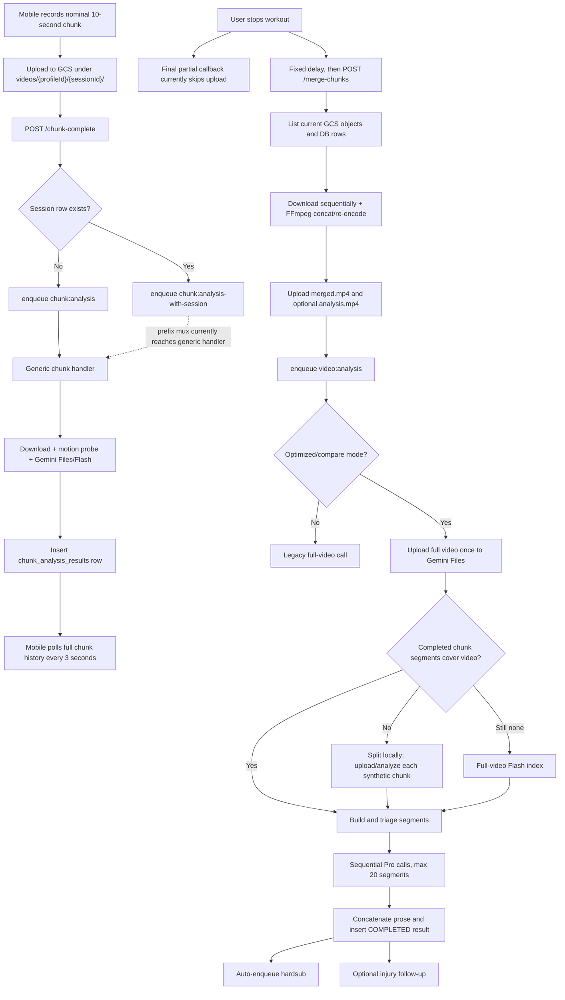

# Current Video Analysis Pipeline

This is a source-level map of the implementation as reviewed on 2026-07-11. It describes behavior that exists now, including defects. It is not the target architecture.

## Entry points and core files

| Area | Primary code |
|---|---|
| Mobile recording, upload scheduling, feedback polling, stop/merge | `app/workout/visionTestPage.tsx` |
| Mobile upload and API calls | `features/wod/api.ts` |
| Request DTOs and routes | `api/internal/controllers/dto.go`, `api/internal/controllers/handlers.go` |
| Worker boot and Asynq mux | `api/cmd/worker/main.go` |
| Task payloads and common dependencies | `api/internal/worker/worker.go` |
| Real-time chunk analysis | `api/internal/worker/chunk_analysis.go` |
| Merge and analysis-grade encode | `api/internal/worker/merge_chunks.go` |
| Uploaded-video splitting | `api/internal/worker/split_video.go` |
| Two-pass and legacy full analysis | `api/internal/worker/video_analysis.go` |
| Gemini upload/generation/media settings | `api/internal/gemini/client.go` |
| Injury, highlight, and subtitle follow-ups | `api/internal/worker/injury_analysis.go`, `verify_highlights.go`, `generate_highlight.go`, `generate_hardsub.go` |
| DB row shapes | `api/internal/db/db.go` |
| Schema history | `api/internal/db/migrations/` |
| Worker/runtime configuration | `api/internal/config/config.go`, `infra/compute.tf`, `infra/variables.tf` |

## Current flow

## Real-time path in detail

### 1. Capture and timing

`startChunkLoop` in `app/workout/visionTestPage.tsx` records nominal 10-second clips. `start_secs` and `end_secs` are calculated from JavaScript `Date.now()` relative to `recordingStartTime`.

These values are capture wall-clock offsets, not offsets in the eventually concatenated media. Android deliberately waits 500 ms between recordings for camera stability. FFmpeg later removes that off-camera gap when it concatenates files. The current DB and full-analysis code nevertheless treat the client offsets as merged-video offsets.

### 2. Upload scheduling

The mobile screen supports:

- A serial in-memory upload queue (`uploadQueue`, `enqueueUpload`, `drainUploadQueue`).
- Fire-and-forget concurrent uploads (`trackUpload`).
- Optional compression before upload.

The queue catches and logs upload failure but does not surface a durable failed state to finalization. The stop flow does not await either the serial queue or all concurrent upload promises.

When `stopChunkRecording` sets `isRecordingChunks.current = false`, the final `onRecordingFinished` callback records the local path but deliberately skips its server upload. This drops every final partial interval and can also drop a nearly full interval.

### 3. Notification and task selection

`processWorkoutChunk` in `features/wod/api.ts` uploads the object and calls `POST /chunk-complete`. `ChunkCompleteRequest` contains the GCS URI and capture offsets but has no `chunk_index`, expected count, size, checksum, or media duration.

`Controller.ChunkComplete` in `api/internal/controllers/handlers.go`:

1. Validates session, GCS URI, profile ownership, and workout type.
2. Looks for a `sessions` row.
3. Enqueues `chunk:analysis` when no session exists.
4. Enqueues `chunk:analysis-with-session` when a session exists.

There is no PENDING chunk row before enqueue and no uniqueness option on the task. A duplicate notification can therefore repeat the upload-analysis-persistence cost.

### 4. Worker routing defect

`api/cmd/worker/main.go` registers `chunk:analysis` but not `chunk:analysis-with-session`. Asynq's serve mux performs prefix matching, so the longer type is handled by `HandleChunkAnalysisTask`, not `HandleChunkAnalysisWithSessionTask`.

The specialized handler exists and loads session/profile context, but production wiring does not select it. The current session-handler test directly calls the wrong/generic handler on its success path, so it does not protect mux wiring.

### 5. Chunk analysis and persistence

The generic handler:

1. Downloads the chunk from GCS.
2. Runs the FFmpeg motion probe concurrently with the model call.
3. Builds profile, WOD, movement, injury, and heart-rate prompt context.
4. Uploads the clip to Gemini Files, waits for ACTIVE, and generates with `gemini-3.7-flash`.
5. Deletes the Gemini file.
6. Parses an exercise tag and optional observed-signals block from free-form text.
7. Inserts a `chunk_analysis_results` row.

Important current behavior:

- The prompt calls user-entered movements “confirmed,” which biases movement detection.
- Missing profile attributes are replaced by a fictional default person in `lookupProfileString`.
- Default Files API video processing is 1 FPS; no custom FPS is set for this fast-action path.
- `WorkoutConfidence` and `MotionScore` are persisted but do not avoid or route model work.
- The handler checks `analysis == ""` before checking `err`. On an error with empty text, the intended FAILED-row branch is bypassed.
- DB `Create` errors are ignored.
- There is no unique chunk identity in the schema.

### 6. Mobile feedback polling

The recording screen calls `fetchChunkAnalysis(sessionId)` every three seconds and retrieves the chunk result collection again. There is no `after_id`, cursor, or latest-only request, so database/network work grows with session length.

## Stop, merge, and full-analysis path in detail

### 1. Stop/finalize race

The mobile stop flow waits for the camera callback but not successful server uploads. It then starts merge after a fixed delay. `MergeChunksRequest` has no expected chunk count or manifest.

The merge worker can only list whichever GCS objects are visible at that moment. It cannot know that another upload was intended, failed, or is still pending.

### 2. Merge discovery and ordering

`HandleMergeChunksTask` in `api/internal/worker/merge_chunks.go`:

1. Lists original chunk objects under `videos/{profileId}/{sessionId}/`.
2. Queries DB rows with status COMPLETED or FAILED and excludes synthetic split names.
3. Retries while a listed GCS object lacks a DB row.
4. Builds merge order from DB `start_secs`.

The intended GCS-existence filter is ineffective: the code constructs `dbMap` from DB records and then tests each DB record against that same map. A stale or duplicate DB row can be included even when it was not in the GCS listing.

The GCS listing is a snapshot, not an authoritative expected manifest. A late chunk absent from the snapshot is invisible and the merge can succeed without it.

### 3. Media construction

Chunks are downloaded sequentially. `runFFmpegConcat` re-encodes to H.264 at 30 FPS and AAC, producing `merged.mp4`. This makes a continuous output timeline; capture gaps are not represented.

If the merged file exceeds `maxAnalysisVideoSizeBytes`, the worker attempts an analysis copy. The comment says 500 MB but the constant is `1000 << 20` (about 1000 MiB). Files over the separate 1 GiB hard limit are rejected later. `runFFmpegAnalysisEncode` uses `scale=720:-2`, meaning width 720 rather than height 720, and retains audio even though most coaching analysis is visual.

Both `merged.mp4` and `analysis.mp4` remain under the required session prefix. No GCS lifecycle policy currently removes temporary/source/derived artifacts.

### 4. Pipeline mode

`PIPELINE_MODE` accepts `legacy`, `optimized`, or `compare`. If unset, configuration selects optimized only when `GEMINI_USE_CACHE=true`; otherwise it defaults to legacy. Infrastructure example variables still show legacy, so deployed behavior must be verified from actual environment values rather than inferred from source defaults.

In `HandleVideoAnalysisTask`, both `optimized` and `compare` call only `handleVideoAnalysisTwoPass`. The video path therefore does not produce two comparable variants in compare mode. Injury handling has separate compare behavior and can add duplicate model cost.

### 5. Optimized full analysis

`handleVideoAnalysisTwoPass`:

1. Downloads the GCS object.
2. Ensures `merged.mp4` exists for direct uploads.
3. Re-encodes above the configured threshold and enforces the 1 GiB hard maximum.
4. Uploads one full video to Gemini Files and stores it for up to 47 hours when injury follow-up may reuse it.
5. Prefers COMPLETED chunk rows as the segment index.
6. If chunk coverage appears absent/incomplete, splits the local video into nominal 10-second files and analyzes those with Flash.
7. If no usable chunk segments remain, calls a full-video Flash index.
8. Triages to a duration-based budget (minimum 3, maximum 20).
9. Calls Pro sequentially for each selected segment with 5 FPS and medium media resolution.
10. Concatenates segment prose, parses highlight/score blocks, inserts one COMPLETED result, and enqueues follow-ups.

### 6. Uploaded-video split path

`splitAndAnalyzeChunks` uses FFmpeg segmenting with `-c copy`. Segment boundaries therefore follow source keyframes and are not guaranteed to be exactly 10 seconds.

The code sets each start offset to `index * 10` while using the probed duration only for that chunk's end. If an early split is longer or shorter than 10 seconds, every later timestamp drifts. Errors in individual goroutines increment a counter and are logged, but the function returns `nil` after all goroutines finish.

The inline split prompt does not carry all real-time context fields and does not parse/persist observed signals. It is therefore not behaviorally equivalent to the real-time path.

### 7. Segment construction, triage, and analysis

`buildSegmentsFromChunks` selects COMPLETED rows, discards rows with no exercise, then `mergeSegmentsByMovement` combines adjacent remaining segments when movement text matches case-insensitively.

Because rest rows are removed before merging, `Snatch -> rest -> Snatch` becomes one long Snatch segment. Movement names are free text, so spelling and aliases fragment or merge unpredictably.

Triage sends the full video again at high media resolution. Its budget depends only on video duration. On triage parse/call failure, the first N segments are selected, which can omit later movements and fatigue evidence.

Segment failures are logged and skipped. Any non-empty aggregate is saved as COMPLETED; there is no minimum successful count, union-of-time coverage, or per-movement coverage requirement. The log reports selected count rather than actual successful count.

### 8. Output, history, and scoring

Each Pro response is free-form text with fenced blocks parsed by regex. There is no SDK response schema and limited semantic validation of timestamp ranges, enums, duplicates, score range, or the documented score formula.

Independent segment outputs are concatenated. There is no final evidence synthesis. Only the last selected segment receives historical context and the session-score request, so that call is asked to score a whole session without seeing the other segment analyses. Current history is injected before the new score is computed.

### 9. Result state and retries

`analysis_results` has a unique index on `session_id`. The two-pass handler inserts FAILED in a deferred error path and independently inserts COMPLETED on success. Insert errors are not consistently checked. A failed attempt can occupy the unique key, after which a successful retry cannot replace it; the task can return success while the visible row remains FAILED.

Workers manually stop retrying after retry count 3 in some handlers, but task constructors generally use Asynq defaults. Other task types have different/no caps. Timeouts, retries, and queue names are not defined per task.

### 10. Follow-ups and cleanup

Full analysis automatically enqueues hardsub generation even when TTS is disabled. Hardsub generation downloads and re-encodes the full video, so subtitle creation has material CPU, memory, latency, and storage cost independent of TTS.

Injury and hardsub enqueue failures are logged after the main result is committed. Returning an error at that point would repeat expensive analysis, while returning success loses the follow-up. There is no outbox/checkpoint state to resolve this conflict.

The Gemini client polls Files API state without an explicit maximum poll duration. `UploadVideo` can return a partial `FileName` on polling failure, but caller cleanup is installed only after a fully successful return. Deferred delete operations sometimes reuse a canceled task context. These paths can leave temporary Gemini files until the service's automatic expiration.

## Current external cost drivers

- One Files upload and one `gemini-3.7-flash` generation per real-time chunk.
- For a direct upload, potentially one Files/Gemini lifecycle per synthetic 10-second chunk in addition to the full-video upload.
- Full-video high-resolution indexing/triage or verification calls.
- Up to 20 Pro segment calls with repeated long prompt/output contracts.
- Default thinking is not explicitly configured (`gemini-3.7-flash` currently defaults to medium; `gemini-3.1-pro-preview` to high).
- Automatic hardsub full-video re-encode.
- Persistent raw, split, merged, analysis, hardsub, and highlight objects without lifecycle cleanup.
- Full Gemini responses and some profile/analysis content logged at information level.

## Why fixes must be measured in order

Current missing chunks and timestamp drift alter which movements and frames reach the model. Duplicate rows and stale FAILED state alter reported completion. Therefore a cheaper model can appear “better” or “worse” because the input set changed, not because model quality changed. Phase 1 creates a reliable source of truth; Phase 2 makes comparisons observable; only then should accuracy or cost variants be promoted.
